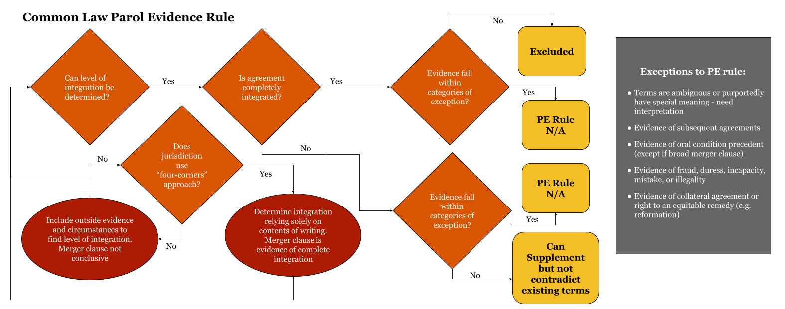

# Contract Law

## General Overview

* What is a contract? A contract is a promise or set of promises that the law recognizes as a duty and for which the law provides a remedy
  * Can be express or implied
  * May also be constructive (so-called quasi-contracts), which are contracts imposed by law in order to prevent unjust outcomes

### Governing Sources of Contract Law

* First, **Article 2 of the Uniform Commercial Code (UCC)**, a uniform body of laws governing commercial dealings has been adopted by all 50 states
  * Although there are some slight variations, they are--as their name suggests--virtually uniform across all jurisdictions
  * Article 2 **governs sales of goods**
    * "Sale" includes transactions between merchants + consumers, merchants + merchants, and consumer-consumer sale of goods
    * **Goods are all tangible things (except money) that are moveable** at time of agreement
      * Includes transactions involving:
        * **Goods to be severed from the land** (minerals, crops, other fixtures)
        * Livestock,
      * Does **not apply** to real estate transactions, contracts for services, contracts for intellectual property (patents, trademarks), lease of goods (though this is covered in UCC 2A), and insurance
  * Parties may, subject to some limitations, vary the provisions of the UCC by agreement
    * Exceptions: good faith, diligence, reasonableness, and care

* Second, the **common law of contracts**: the traditional yet constantly-evolving set of rules/principles reflected in state common law
  * This governs just about everything else not covered by the UCC: real estate, services, intellectual property, leases of goods, insurance
  * However, **even in contracts for sale of goods**, common law is not entirely displaced by UCC and is **only preempted where there are conflicts**; this means **common law fills in the gaps that the UCC does not cover**

* Hybrid cases - where contract involves both sale of goods and services
  * Majority rule - determine governing source of law using **Predominant Purpose Test**, which attempts to **ascertain if primary purpose of transaction** was goods or services. This considers:
    * The contract itself (what does language/terminology suggest?)
    * The value of the goods furnished in comparison to the services
    * The nature of the merchant's business (is it primarily a service provider or seller of goods?)
  * Examples:
    * Construction contracts generally not governed by UCC, even if involve the procurement of goods
    * Delivery and installation contracts are usually governed by UCC where the delivery/installation component is only minor component

---

## Contract Formation

### Overview of Valid Contract Formation

* A valid contract is formed when there is:
  * (1) manifestation of mutual assent (an offer and acceptance) to be bound to an agreement
  * (2) with reasonably certain and definite terms
  * (3) supported by adequate consideration or a substitute
  * AND (4) no defenses to formation that would invalidate an otherwise valid contract

* Contracts can be:
  * Void - no valid K was ever formed; entirely without legal force and cannot be enforced by either party
  * Voidable - operates as valid K until/unless one party takes steps to avoid it
  * Unenforceable - satisfies all the elements of valid contract formation (1-4 above) but still that cannot be enforced due to some other rule of law

* Determining **intent** of parties to a contract
  * Objective Theory of Contract - One is either bound or not bound, not by one's secret intent, but by the **reasonable interpretation of their words and actions**
  * Unlike historical "meeting of the minds" theory, **subjective intent to be bound is not essential** part of contract formation, only words/actions taken to manifest assent are what binds one to contract

### Manifestation Mutual Assent - Offer

* **Offer**: (1) a manifestation of willingness by the offeror to enter into an agreement, (2) so made as to communicate to the offeree that his assent to that offer is invited and will conclude the contract
  * (1) Manifestation of intent to be bound - Some sort of outward communication to the offeree manifesting offeror's intent to be bound
    **Interpretation of an offer or acceptance** is not what the party making it intended to mean, but **what a reasonable person in the position of that party would have thought it to mean**
    * As long as offeree could reasonably conclude that, based on offeror's words/conduct, that he was making offer, doesn’t matter if offeror was subjectively unaware
  * (2) Communication **must also create power of acceptance** - What can be interpreted as a **definite offer should not require additional communication or expression of assent on behalf of the offerer**
    * This is what distinguishes and offer from an invitation to make an offer
      * Where party to whom communication was directed knows/has reason to know that maker didn't intend to conclude bargain until he has made a further manifestation of assent, it is merely a preliminary negotiation or invitation to offer and not an offer itself
    * Traditional rule that advertisements are merely invitations for offers unless they "invite acceptance without further negotiation in clear, definite, express, and unconditional language"

* Termination - Power of acceptance created by an offer can be **terminated in 5 ways**:
  * (1) Offeree's **rejection/counteroffer**
    * Unless: Offeror has manifested a contrary intention (i.e., to stay open, even if initially rejected) OR offeree's non-acceptance also manifests an intention to take it under further advisement.
  * (2) The offeror's **revocation**
    * Offer is generally **freely revocable at any time prior to acceptance**, terminating power of acceptance, **so long as communicated to the offeree** and there is **no pre-existing promise to leave offer open**
      * **Direct revocation** - offeror directly communicates to offeree an intent to withdraw the offer
        * Revocation generally not effective until received by offeree
      * **Indirect revocation** - offer takes action inconsistent with intent to go through with contract and offeree becomes aware of this through reliable source
    * Irrevocable offers - Promise not to revoke over fixed period of time -- such as an **option contract** -- must be supported by consideration
      * Exception: UCC **firm offer rule** - irrevocable w/o consideration if (1) offer made by a merchant (2) in a signed writing (3) that assures offerer that offer is to remain open
        * Only for reasonable amount of time (usually just a few months)
      * May also become irrevocable via doctrines of part performance or promissory estoppel
  * (3) **Time lapse** - if no expiration stated, lapses at end of "reasonable time", determined by considering circumstances
  * (4) **Death/incapacitation** of either party, or destruction of the K's underlying subject matter
  * (5) The **non-occurrence of any condition of acceptance** under the terms of the offer

### Manifestation Mutual Assent - Acceptance

* Acceptance - "Acceptance of an offer is (1) a **manifestation of assent to the terms thereof made by the offeree** (2) **in a manner invited or required** by the offer"
  * (1) Manifestation of assent to the terms thereof made by the offeree - Acceptance **must be unambiguous + unqualified (i.e., mirror terms of offer)** in order for a contract to be formed. Silence, with limited exceptions, does not manifest acceptance
    * Offeree = person with knowledge of offer and power of acceptance; must be objectively reasonable belief that he was party (or member of class of parties) to whom offer was directed
    * "Qualified" or "conditional" acceptances -- those conditional on the offeror’s assent to terms additional to or different from those offered -- constitutes only a **counteroffer** (proposes substituted bargaining) and is the functional **equivalent of a rejection** of the original K (terminates power of acceptance)
    * Exceptions where **silence can be acceptance**
      * One passively **takes benefits** with **reasonable opportunity to reject**
      * **Previous dealings** or some other indication given by offeror creates understanding that **acceptance assumed absent explicit rejection**
  * (2) Manner invited or required -  If an offer **prescribes the place, time or manner of acceptance, must be complied with** in order to create a contract
    * If an offer is **silent on or merely suggests** a permitted place, time or manner of acceptance, **other reasonable means/methods of acceptance** are not precluded (R2d § 60)
      * Medium of acceptance **reasonable if customary** for type of transaction **or used in previous transaction**
    * Even if offeree fails to comply with specified manner of acceptance, may be waived by offeror, either explicitly or implicitly (i.e., by going through with it anyways)
  * Under **UCC**: An offer to make a contract shall be construed as inviting acceptance in any manner and by **any medium reasonable in the circumstances**

* Time When Acceptance Takes Effect - **Unless the offer provides otherwise**, general rule is **effective upon dispatch**:
  * An acceptance made by manner is operative **as soon as put out of the offeree’s possession** (e.g., placed in mailbox), without regard to whether it ever reaches the offeror
    * Contrast this w/ notice of revocation, which is effective only upon receipt
    * Exceptions:
      * Acceptance under an option contract is not operative until received by the offeror
      * Acceptance by mail is not operative at dispatch if improperly addressed or post-stamped
  * **Once effective** at dispatch:
    * **Offer cannot be revoked**, even if offeror has not received acceptance yet
    * A **subsequent rejection does not undo** an acceptance
      * However, converse is not true; **rejection is effective upon receipt**, meaning subsequent acceptance can be effective if placed in mail before rejection arrives

* Comparing acceptance of bilateral K offer and unilateral K offer
  * **Bilateral K** = K formed by the mutual exchange of promises; can be accepted by:
    * Words (oral/written) or other conduct - most straightforward; communication to offeror that is reasonably interpreted as manifesting one'ss agreement to the terms/intent to be bound;
      * Implied-in-fact contract - Conduct by both parties that is intentional and that each party knows (or has reason to know) the other will interpret as an agreement to enter into a contract
      * UCC § 2-204 - A contract for sale of goods may be made in any manner sufficient to show agreement, including conduct by both parties which recognizes the existence of such a contract;
        * When buyer offers to purchase goods (for prompt or current shipment) from, any of the following by seller can be construed as acceptance:
          * Promise to ship
          * Actual prompt or current shipment of conforming goods
          * Actual prompt or current shipment of non-conforming goods (this is also breach)
            * However, if shipment of non-conforming goods is accompanied by notice that it is an accommodation, this becomes a counteroffer
    * Part performance - beginning to render performance by **completing at least part of what the offer requests (i.e., not just mere preparations) can manifest assent to K**, which serves as an **acceptance and promise of full performance**
      * Note: this is only if offer doesn't specify required means of acceptance and part performance is a reasonable means
        * R2d § 32 - "In case of doubt an offer is interpreted as inviting the offeree to accept either by promising to perform what the offer requests or by performing, as the offeree chooses"
      * **UCC** - Where beginning performance is a reasonable mode of acceptance, need to provide notice else offeror may treat offer as lapsed after reasonable amount of time
  * **Unilateral K** = offeror promises to do something return for an act, becomes binding upon completion of that act (i.e., performance is acceptance)
    * Unlike bilateral K, **part performance is not acceptance; must fully perform** to accept and form contract
      * However, **substantial performance being rendered makes offer irrevocable for reasonable time**
    * Unilateral offer generally includes implied subsidiary promise not to revoke (i.e., like an option contract) in exchange for initiation of the invited performance, so long as it is timely
      * By starting to render performance, offeree provides manifestation of assent and consideration for option contract (this is basis for *substantial performance doctrine*)
      * In these "option contracts", the offeree is not bound to complete the performance
    * In reality, it is rare for true unilateral contracts to be formed
      * Pretty much limited to where there are doubts about parties' ability to perform and hence offeror has no interest in promissory acceptance (i.e. show, don't tell)
    * Many modern courts tend to disfavor unilateral contracts; will **only treat as unilateral K if explicitly clear that promissory acceptance is inadequate and performance is necessary to accept**

### Qualified Acceptance: Battle of the Forms

* **Mirror Image Rule** (Common Law Approach) - As noted above, varying acceptance has the effect of only a counter offer. Offeror is master of the offer and any attempt to accept according to different terms is a rejection and a new offer in which the original offeree assumes role as master.
  * **Last Shot Rule**  - Under Common Law, a party implicitly assents to and thereby accepts a counter-offer by conduct which indicates a lack of objection to it (i.e., beginning to render performance)
    * If both parties submitted their own terms, and there was never agreement reached as to which control, the terms last submitted prior to performance control the contract

* **Battle of the Forms** (UCC approach) - applicable to **transactions between merchants**
  * Offeree definite and seasonable expression in response to offer **(i.e., an acceptance) is valid, even with additional/changed terms, UNLESS acceptance is expressly made conditional** on offeror's assent to new terms, in which case it constitutes a counteroffer.
    * **Changed/additional terms become part of K UNLESS**:
      * (1) the **original offer expressly limits** acceptance to its terms
      * (2) they **materially alter** terms of the original offer
        * Typically, terms that materially alter a contract would **result in surprise/hardship** if incorporated without express awareness by the other party
      * (3) offeror **objects to new terms within a reasonable time** from notification
    * If one of the above exceptions, the original terms control instead
      * However, if there are **conflicting terms** in different forms, both terms dropout and term is supplied by UCC default (**Knockout Approach**)
    * **Conditional nature of the acceptance**, to the extent necessary to constitute a counteroffer, must be **clearly expressed** in a manner sufficient to notify the offeror that the offeree is **unwilling to proceed** with the transaction unless additional/different terms are included in the contract
  * **Conduct by parties recognizing existence of a K is sufficient to establish K** even where the writings of the parties (exchange of forms) do not otherwise establish a contract (e.g., where acceptance is "expressly conditional" or where difference in terms between forms vary too greatly)
    * In these cases, terms are those on which parties have agreed on along with supplementary terms provided by UCC
  * Note: Where parties are **not both merchants**, there is still an acceptance and thus K formed, but additional terms are only **proposals to modify and must be assented to** as a modification


### Definiteness and Postponed Bargaining

* General rule - terms of agreement need sufficiently definite to demonstrate agreement (important terms left open = evidence that bargaining not yet complete), as well as to provide a reasonably certain basis for enforcement/providing a remedy
  * **2 threshold questions**
    1. Evidence surrounding **intent to enter an agreement**: was there a clear manifestation of mutual assent?
    1. Granting that there is evidence of an intent to enter an agreement, whether or not terms are **reasonably certain enough to allow court to enforce, remedy, or determine breach**?
       * Note: terms can still be reasonably certain even though it leaves room clarification in the course of performance; court can fill in gaps where reasonable expectations are clear

* **R2d § 204 - Supplying an Omitted Essential Term**
  * When the parties have not agreed with respect to a term which is essential to determining rights/obligations, term reasonable in light of circumstances is supplied by the court

* Essential terms
  * Common law - includes identity of parties, subject matter, price, quantity, parcel of land (in real estate K), and time of payment/delivery/performance
    * Indefinite duration - in K contract, there is presumption this means terminable at will
  * UCC - in K for sale of goods (where both parties are merchants), quantity is the only term whose absence is fatal; all others can be filled in (e.g., price = commercially reasonable price at time of delivery, duration = reasonable time)
    * More liberal approach to indefiniteness of terms than the common law, emphasizing the parties intent to be bound even if some "essential" terms are left open

* Incomplete Bargaining 2 different situations:
  * **Agreement to agree** - parties have reached agreement on a number of things but left for future agreement one or more essential terms
    * Common law - generally unenforceable; even if there is clear intent for parties to be bound, there **still needs to be a reasonably certain basis for ascertaining essential terms** (e.g., some method for determining them)
  * **Formal contract contemplated** - parties have reached agreement on at least the major/essential provisions of the agreement but they contemplate the execution of a formal written K
    * Both UCC and common law acknowledge an agreement in principle may be enforceable even if further negotiation on certain terms or execution of a formal written contract is contemplated though they each treat these differently
    * Another perspective holds that in executing a letter of intent, parties are binding themselves to negotiate in good faith

### Consideration

* Contractual disputes on the basis of insufficient consideration are rare; if they do arise, it is **typically in the context of contract modifications, options contracts, or family agreements**

* "**Bargained-for-exchange**" theory (Majority) - definition of consideration in which there is **reciprocal inducement of a party's detriment by the other party's promise**.
  * Holmesian test of "reciprocal conventional inducement, **each for the other**" is commonly employed by courts.
    * To be consideration, party's detriment must be more than simply incidental to  the other party's detriment/promise; instead, it must have been induced by it (although near impossible to prove)
    * Whether the other party's promise/performance **actually constitutes a benefit is irrelevant, nor must there be equivalence in the values exchanged**
      * Where values are so disproportionate it strongly suggests the transaction is just a gift in disguise, may be found to have inadequate consideration; **must be an actual bargain**
  * **R2d § 71 - Consideration** - To constitute consideration, a performance or a return promise must be bargained for
    * It is bargained for if it is sought by the promisor in exchange for his promise and is given by the promise in exchange for that promise
    * The performance may consist of: an **act other than a promise**, a **forbearance**, or, the **creation/modification/destruction of a legal right/position/relation**
    * The performance or return promise may be given to the promisor or to some other person. It may be given by the promisee or by some other person

* "Benefit/Detriment" theory (minority) - Consideration is defined in terms of some benefit to the promisor OR detriment to the promisee (See *Hamer*)
  * Has deep roots in Anglo-American common law and has largely been replaced by the bargained-for-exchange theory

* Things that are **not supported by adequate consideration include:**
  * **Promise to make gift** is not supported by consideration; other party incurs no legal detriment in exchange for promise;
    * May be enforceable if gift is conditioned on something that could have reasonably induced the promise
    * Also, charitable gifts often recognized as exception to consideration requirement, or alternatively, as being given with attached implicit promise/condition that it be used for certain purpose (and is thus valid consideration)
  * Promise in supported by **past/moral consideration** - promise made in **exchange for past performance**, and/or, out of a sense of moral obligation is not sufficient consideration
    * See exceptions below
  * **Pre-existing duty** rule - in context of contractual modifications, promising to perform an existing obligation will not serve as valid consideration for additional return compensation from the other party
    * Exception for pre-existing duty exchanged for third-party's promise
    * Today, courts accept even a small/modest addition/alteration of performance as enough to constitute consideration, though needs to reflect more than a pretense of bargain
  * **Illusory promises** - promises that appear, on their face, to be so insubstantial as to impose no obligation on the promisor; performance is voluntary and is thus invalid consideration

* Exceptions where agreements **binding w/o consideration**
  * May also still be enforceable via **promissory estoppel** if substantial detrimental reliance on promise
  * **Material benefit rule** - A promise made in recognition of a material benefit previously received is binding to the extent necessary to prevent injustice; however, intent cannot be donative and must be past benefit received
    * Also exceptions for debt/claims discharged in bankruptcy or barred due to SoL
  * UCC **firm offer rule** - offer form merchant signed in writing with promise to keep open for certain amount of time (i.e., effectively an option contract) does not need to be supported by consideration to be enforced
  * Common law - contractual modifications due to **unanticipated changes in circumstances** do not require additional consideration
  * Under **UCC, good faith modifications** to contract to not need to be supported by additional consideration
    * Modification without legit commercial reason and extortion still barred barred

---

## Quasi-Contracts

* Even where some defect in formation (e.g., lack of consideration) that prevents the existence of a valid contract, promise/agreement may nonetheless be enforceable to prevent what would otherwise be an unjust outcome
  * Contracts implied in law, or so-called "quasi-contracts", refers to situations in which a party is bound as if there were a valid contract; this is applied as a legal fiction for singular purpose of providing remedy
  * Can be contrasted w/ Contracts implied in fact, which are real contracts and involve traditional bargaining process (i.e., party receiving the benefit requested it)

### Promissory Estoppel

* Promissory Estoppel - doctrine of contract law that "estops" party from denying existing of a valid contract to avoid performance in order to prevent injustice to other party
  * Although no formal consideration for the promise, unbargained-for reliance serves as a substitute for consideration in contractual enforcement
  * Promissory estoppel invoked when:
    * (1) **The promisor reasonably expects his action/promise will induce action**
    * (2) **Promisee acts in reliance on this promise (the term detrimental reliance often used here)**
    * (3) **Injustice may only be avoided through enforcement**
  * Remedy will be limited by what justice requires (see reliance damages)
  * Does not explicitly use “detrimental reliance” language, but the phrase is often used to refer to that section’s requirement that the promise induce “action or forbearance” by the promise

* In the context of land transfers: when the donee has made substantial improvements to the land in reliance upon the promise to convey the land, courts will enforce the promise even if no consideration (or if there was failure to satisfy SoF)

* In the context of charitable and intra-family promises - these to be purely gratuitous, not part of bargained-for-exchange, thus run into problems related to inadequate consideration
  * Promissory estoppel provides court with a tool to reach equitable resolutions to intra-family disputes
    * Most promises in the family context are actuated by feelings of affection and altruism rather than by the expectation of quid pro quo
    * Makes enforceable what would otherwise be an unenforceable promise, when there has been reliance on that promise
  * Promissory estoppel charitable promise with donative intent to be enforceable
    * Although "charitable subscriptions" are exception to consideration requirement without requiring reliance, court's have been extremely reluctant to apply this; promissory estoppel provides alternative basis for enforcement

* In Commercial Contexts
  * **UCC does not explicitly recognize promissory estoppel** as a defense to non-enforcement; however, a number of features of the UCC as well as the type of transactions it applies to (i.e., sale of goods) greatly reduce the need for enforcement via promissory estoppel
  * However, has been applied in the employment context (which is governed by CL), such as where employee agrees to early retirement in exchange for promised annuity payments (no consideration since no right to ongoing employment and thus no legal detriment incurred); court enforced this promise via promissory estoppel, as there was detrimental reliance on promise (P retired, giving up stream of employment earnings)
  * **Option Contracts**
    * An option contract **can be made binding and irrevocable by subsequent action in reliance upon it** it even though such action is neither requested nor given in exchange for the option promise
    * When an option is conditioned upon a performance of certain acts, the performance of the acts may constitute a consideration to uphold a contract for option. However, there is no such condition imposed if the acts wer not intended to benefit nor were they incurred on behalf of the option
    * Distinction from unilateral contract is fuzzy?
  * Unilateral Contracts
    * Offer inviting performance (and not promissory acceptance) caries implied promise not to revoke once performance begins. The start of performance serves as consideration which makes subsidiary promise binding
    * Merely acting in justifiable reliance on an offer may, in some cases, serve as sufficient reason for making the subsidiary promise binding (see §90)
    * Reasonable reliance resulting in a forseeable prejudicial change in position affords a compelling basis for implying the subsidiary promise not to revoke

### Unjust Enrichment and Pure Restitution

* Restitution is a remedy used when one person is unjustly enriched at the expense of another, typically when there is a failure to exchange promises/some other problem in K formation
* **Two central elements of restitutionary recovery**:
  1. **Enrichment of one person** - Some sort of **benefit conferred upon an individual unofficiously (i.e., some knowledge/appreciation of benefit)**
     * Person acting officiously (i.e. "thrusting" their services on another and demanding payment) is not entitled to restitution
  1. Circumstances where the **retention of benefits without recompense would be unjust** to another person
     * Person acting without intent to charge (i.e. offered as a gift) is also not entitled to restitution (e.g., can't provide gift w/ donative intent and change mind later on)

* **Restatement (Third) on Restitution**:
  * § 1 - A person who is unjustly enriched at the expense of another is subject to liability in restitution
  * § 20/21 - Protection of Another’s Life or Health/Property
    * A person who provides care required for the protection of another’s health or property is entitled to restitution to the extent needed to prevent unjust enrichment (measured by a reasonable charge for the services in question), if the circumstances justify (i.e. emergency/necessary services OR reasonable to assume person would consent) the decision to intervene without request

---

## Defenses to Formation

### Misunderstanding/Mistake

* **Effect of Misunderstanding (R2d § 20)**
  * **No mutual assent** if parties attach **materially different meanings to their manifestations AND:**
    * (a) There are two reasonable meanings and **neither knows/has reason to know what other meant OR**
    * (b) **Each party knows/has reason to know** the meaning attached by the other
  * You **have manifestation of assent** to the meaning attached by a party if:
    * (1) **One party does not know/have reason to know of different meaning** attached by the other; **AND**
    * (2) The **other knows/has reason to know** the meaning attached by the first
    * In this case, there is valid contract and **meaning known to both parties controls**
      * Unless first party voluntarily choses to have K enforced according to other party's meaning (i.e., the one he originally did not know about)
  * In determining whether there are materially different meanings, needs to be subjective determination of the meaning each party *actually* attached; however, the determination of whether party should have known what the other party meant should be an objective one

* **Mistake** - if, **at the time of formation**, party/parties are **mistaken as to basic/material factual assumptions/beliefs underlying the contract** at the time, contract may be voidable
  * Mutual mistake - if **both parties are mistaken** as to basic factual assumption at time of formation and this has **material affect on K**, the contract **may be voidable by adversely affected party unless he assumed this risk**
    * Voidable = may be **rescinded or reformed**; however, most courts disallow rescission where reformation is an adequate remedy
    * Price/value of contractual subject matter usually not considered material; thus not voidable even if mutual mistake
  * Unilateral mistake - where **only one part is mistaken** (almost always the one adversely affected, else he wouldn't have agreed), contract is **generally not voidable**
    * Potential exceptions:
      * Other party is well-aware of other party's mistaken assumptions
      * Where the mistake is so egregious that enforcement of K would be unconscionable

### Incapacity

* Infancy/Minors -  person **under the age of 18** only has capacity to incur **voidable** contractual duties
  * Limitation on necessaries. Minor liable for the value of items one needs to live (i.e. food, clothing, and shelter)
  * Where seller enters contract for sale of goods with minor which is subsequently disaffirmed, he is traditionally without remedy for substantial diminution in the goods value absent a showing that the minor misrepresented his age or willfully destroyed the property

* Mental incapacity (intoxication, mental illness/defect) - Person generally incurs **voidable** contractual duties by entering into a transaction if **unable to understand the nature/consequences** of the transaction and the **other party knows** or has reason to know of his condition
  * In the case of mental illness or defects, even if person has limited understanding of a particular transaction, controlling consideration in determining voidability whether person acted in the manner of a reasonably competent person w/r/t the transaction

### Undue Influence

* Undue influence is **unfair persuasion** of a party who is **under the domination** of the person exercising the persuasion (e.g., large information asymmetry) **OR** of a party with whom person is **in a special confidential/trusted relationship** where he assumes the other will not act in a manner inconsistent with his welfare (e.g., trustee-beneficiary, doctor-patient)
  * A person's **assent, if induced by undue influence from other party, makes the K voidable**
  * Fairness of persuasion -- or the extent to which it overwhelms persons free will -- takes several factors into account including their level of vulnerability, the relationship, and the nature of the persuasion
  * If assent is induced by one who is not a party to the transaction, the contract is still voidable by the victim unless the other party to the transaction in good faith and without reason to know of the undue influence either gives value or relies materially on the transaction

### Duress

* **Duress** - defense that assent was invalid because it was (1) **induced by wrongful/improper threat** that (2) **left party without meaningful choice**

* A **threat is improper** if:
  * What is threatened is a crime or a tort, using the legal process (i.e., to sue) in bad faith, breach of the duty of good faith and fair dealing **OR**
  * The resulting exchange is not on fair terms, and:
    * would harm the recipient without significantly benefiting the threatening party making the threat
    * prior unfair dealing by the threatening party significantly increases effectiveness of the threat in inducing assent
    * is otherwise a use of power for illegitimate ends

* **Resulting circumstances left without meaningful/reasonable alternative**
  * What constitutes a reasonable alternative is a question of fact depending on the circumstances of each case
  * In cases of economic duress, demonstrate that one had **no reasonable choice but to agree to the other party's terms or face serious financial hardship** and that the lack of reasonable alternatives was the result of D's wrongful conduct (and not its own necessities)
    * Usually b/c no affordable substitutes available or would cause party to breach other contractual obligations

* Those claiming duress typically seek to avoid the contract or any modifications/settlements
  * Where physical compulsion (instead of economic), K is automatically void; else, contract is voidable

### Misrepresentation and Nondisclosure

* A contract is **voidable** if a party's manifestation of **assent is induced by either fraudulent or a material misrepresentation** by the other party upon which the recipient is **justified in relying**
  * "Material" - a representation is material when so substantial as to influence the other party
  * An opinion defines an express of a belief, without certainty, as the existence of a fact. These are typically given a certain degree of leeway, but statements of opinion may be actionable in certain relationships (e.g. fiduciary, expert reliance, etc.)
    * An opinion can also be actionable for misrepresentation if it can be demonstrated that it was not genuinely held

* Fraudulent Misrepresentation:
  * (1) D made **false representations** as a statement of **existing and material fact**
  * (2) D **knew representations to be false** or made them **recklessly without knowledge**
  * (3) D made representations **intentionally for the purpose of inducing** another party to act upon them
  * (4) Other party **reasonably relied/acted** upon representations and **sustained damages** as a result

* Fraud by Silence (Fraudulent Nondisclosure):
  * (1) D had knowledge of material facts **not reasonably discoverable** by other party
    * Court may take into account differences in the levels of intelligence between parties, the nature of the relationship, and the degree to which information is readily discoverable or verifiable.
  * (2) D **intentionally failed to communicate facts under obligation** to do so
  * (3) P **reasonably relied on completeness** of defendants representations and **sustained damages** as a result

* Negligent Misrepresentation - may be made innocently but nonetheless render contract avoidable
  * (1) Person supplying false information has **failed to exercise reasonable care or competence** in obtaining/communicating material information
    * Unlike the two fraud-based defenses, this does not have scienter requirement
  * (2) Person **justifiably relying upon** false information is the intended beneficiary of the information supplied
  * (3) **Damages** are suffered by relying party in transaction that negligent party is trying to influence

* Remedies
  * Avoidance (a defense, not a remedy), although may not be voidable if misrepresented facts are cured by D
    * Fraud in the factum (aka fraud in the execution), in which misrepresentation induces person into transaction they have no knowledge of, renders any agreement automatically void
  * Rescission equitable remedy commonly used is instances of misrepresentation and nondisclosure
    * In such cases under modern law, victim has choice between tort action for damages or avoiding the contract by way of rescission
  * Judicial return of the parties to the status quo that existed before the contract was formed
    * Requires injured party to return any money or property he has received
    * May not be available where property has since been transferred to another party

---

## Avoiding Enforcement

### Unconscionability

* General definition - One party’s lack of meaningful choice (typically due to lack of understanding or unequal bargaining power), K terms unreasonably favor the other party to extent that is grossly unfair and should be unenforceable
  * Judged as to the time the K is made; not based on developments after K formed
* Procedural and Substantive Unconscionability - **Typically need both, but on a sliding scale**
  * **Procedural** - What went into the process of making the K; conspicuousness + intelligibility of a clause; oppression or surprise because of the unequal bargaining power (may reflect lack of choice);
  * **Substantive** - Terms that are “overly harsh” or one-sided; outrageously unfair so as to shock the judicial conscience; no many would accept; commercially unreasonable; applies to purpose + effect of the terms along with allocation of risk between the parties
* Unconscionability under both the UCC and CL
  * **R2d § 208 - Unconscionable Contract or Term** - If a court finds the contract or any clause of the contract to have been unconscionable at formation, it may refuse to enforce the contract, enforce it without unconscionable clause, or limit application of clause so as to avoid an unconscionable result
  * **UCC § 2-302 - Unconscionable Contract or Clause** - formulation is identical to R2d §208, but adds that when unconscionability is claimed, parties shall be given a reasonable opportunity to present evidence as to its commercial setting, purpose and effect

### Public Policy and Illegality

* Process of formation is untainted, but K may still be unenforceable because it **violates/runs contrary to public policy or because consideration/performance to be rendered is illegal**, making the K void.
  * Illegality - classic example of contract that is unenforceable due to illegality is contract to commit a crime (i.e., illegal subject matter), but can also be one intended to serve/further some illegal purpose (e.g., contract to legally sell firearms to be used in armed robbery)
    * Generally no remedies available when this is the case (including restitution or PE; potential exceptions where one party lacks knowledge of the illegal status or the other party's illegal purpose/intent (must be reasonable/justifiable; no willful ignorance)
  * Public policy - Unenforceable on public policy grounds **if determined so legislatively or if interest in its enforcement is clearly outweighed by a public policy against its enforcement [balancing test]**
    * Strong policy interest in freedom of contract so there must be a well-established basis for any public policy that would deny enforcement of a K; courts **usually take into account**:
      * **Pro-enforcement factors**: Parties' justified expectations, the forfeiture/hardship that would result if enforcement denied, and policy interests served by enforcement
      * **Pro non-enforcement factors**: Strength of the policy interest (manifested in other judicial/legislative decisions) that would be served by non-enforcement (and the degree to which it would served), as well as the extent to which terms deliberately involve misconduct
    * Comes up in context of family law/children, exculpatory provisions, covenants not to compete
      * Non-compete clause example: Will be unenforceable if it does not protect legitimate business interest outside of shielding firm from competition and/or restricts labor mobility (strong PP interest) greater than necessary to protect legit business interest

---

## Statute of Frauds

### The Statute of Frauds: General Principles

* The Statute of Frauds
  * Refers to any statute (or body of law) that **requires certain types of contracts to be in writing in order to be enforceable**
    * No one statute of frauds but a series of state statutes + state common law + UCC
    * Justifications - evidentiary function, prevents accidental/unintentional Ks, fraud prevention, formality signals gravity/seriousness of undertaking
  * Not an issue of contract formation, but an **issue of contract enforcement**
    * Need a valid K before SoF becomes applicable
    * Must still satisfy other formation requirements in addition to writing requirement
  * Contract governed by the SoF **can be enforced against a party that signed, not one that didn’t**. Both parties might have contracted parties but, if the SoF applies, K can only be enforced against the party that signed
* Minimum requirements to satisfy the SoF:
  1. K must be signed by the party charged (i.e. party against which performance is sought)
  1. The essential terms must be listed

* Questions to be raised when SoF is asserted as defense against enforcement
  1. Is the contract at issue one of the types to which the SoF applies?
  1. Has the SoF been satisfied?
  1. Are there other factors in the case (i.e. reliance or tendered performance) which might invoke an exception?

### Statute of Frauds - Contracts Not Involving Sale of Goods

* The following classes of contracts are subject to SoF, forbidding enforcement unless there is a written memorandum or an applicable exception
  * A contract to **transfer/receive of an interest in real property** (but not the conveyance document itself, i.e., the deed)
  * A contract that is **not to be performed (completed) w/in one year from the making** thereof
  * A contract of an executor or administrator to answer for a duty of his decedent (the executor-administrator provision);
  * A contract to answer for the duty of another (suretyship)
  * A contract made upon consideration of marriage (e.g., prenups)

* Satisfying SoF - A contract within the SoF is enforceable if:
  * (1) It is **evidenced by any writing, signed by or on behalf of the party to be charged**
  * (2) Writing **reasonably identifies the subject matter** of the contract
  * (3) Writing is **sufficient to indicate that a contract has been made between the parties or offered by the signer** to the other party, and
  * (4) States with **reasonable certainty the essential terms** of the unperformed promises in the contract

* Writings -  The memorandum may consist of several writings if one of the writings is signed and the writings in the **circumstances clearly indicate that they relate to the same transaction**
  * Signature = any symbol made or adopted with an intention, actual or apparent, to authenticate the writing as that of the signer
  * Except in the case of marriage contract, SoF may be a signed writing not made as a memorandum of a contract (e.g. informal letter, meeting minutes, etc)

* Exceptions:
  * **Reliance exception** - A promise which the promisor should **reasonably expect to induce action** by the promisee and does so in fact is enforceable, notwithstanding the SoF, if **injustice can be avoided only by enforcement** of the promise
    * Circumstances significant in determining whether injustice can be avoided only by enforcement of the promise include
      * The reasonableness of the action taken in reliance
      * The extent to which the action was foreseeable by the promisor
      * The extent to which the action corroborates evidence of the making and terms of the promise, or the making and terms are otherwise established by clear and convincing evidence
    * K for the transfer of an interest in land may be specifically enforced notwithstanding failure to comply with the SoF if established that the party seeking enforcement, in **reasonable reliance** on the K and on the continuing assent of the party against whom enforcement is sought, has so changed his position that injustice can only be avoided by specific enforcement
  * **Tendered Performance exception** - even if oral contract for the transfer of an interest in real property is not enforceable at the time it is made due to SoF, **subsequent acts by either party that show the existence** of the contract may make it enforceable, even without a writing. These are acts which alone, without the promise, are unexplainable. Such acts include:
    * Payment of all or part of the purchase price
    * Possession by the purchaser; or
    * Substantial improvement of the property by the purchaser

### UCC Statute of Frauds and the Sale of Goods

* Differences from common law:
  * Applicable to contracts or modifications to contracts for **sale of goods over $500**
    * Also lease of goods > $1,000 and other personal property > $5,000
  * Still need signed writing, but possibly fewer terms needed (**identity of parties, quantity**)
    * "Writing" can consist of multiple writings; need not take form of formal contract
* Exceptions
  * **Merchant Confirmation** - If between merchants and **written confirmation submitted within reasonable** time after the contract was formed and **received by other party** (who knows of it), satisfies the SoF (i.e., enforceable against receiving party) unless receiving party **objects within 10 days**
    * Lack of object is equivalent of them signing the writing
  * **Specially manufactured goods** exception - if tailored goods **not suitable for sale to others** in the ordinary course business and seller has made **substantial beginning** of their manufacture or procurement, writing is not required
  * Accepted payment/receipt - enforceable against seller if payment has been and against buyer if goods have been received and accepted
    * UCC makes exception if party admits, either explicitly or implicitly (through its conduct) that there is a contract
    * Using SoF defense is equivalent of denying existence of enforceable K

---

## Contractual Interpretation and Parol Evidence

### Parol Evidence Rule

* Parol Evidence - Evidence, either written or oral, that is **extrinsic** to a written agreement
* Parole Evidence Rule - Rule that **such evidence will be excluded from the trier of fact**. However, the rule has **many exceptions** and intricacies
  * Not a rule of evidence, but a rule of substantive law
  * Still subject to rules evidence: to be prima facie admissible into court must be "relevant" (probative of some fact material to the parties' dispute)

* **Complete Integration** - When parties have mutually agreed to integrate a final version of their entire agreement in a writing, which is intended as a **complete and exclusive statement of the terms** of the agreement **neither party allowed to contradict/supplement w/ parol evidence**
  * Merger Clause - states that the writing is intended to be final and complete; all prior understandings have been “merged” into or superseded by the final writing. Purpose is to tell courts we intend this to be a fully integrated agreement
  * Some courts give full acknowledgement to these clauses and do not allow PE
  * Other courts do not, especially in a contract of adhesion or a situation where there is unequal bargaining

* **Partial Integration** - When a writing is intended to be **final but not complete** (i.e., only final with respect to a part of their agreement), the agreement **may be supplemented** by external evidence, but terms **cannot be contradicted**
  * Rather than find a contract to be partially integrated, Court more frequently treats it as complete but with ambiguity, allowing PE to be admitted

* The correct application of the parol evidence rule requires that the court first make determination on the preliminary question of whether the writing is intended to be a final expression of the parties agreement (i.e., decide whether completely or partially integrated)
  * **Four Corners Rule** - Question of whether final and complete expression **must be determined from the four quarters of the writing** without resort to extrinsic evidence. A substantial number of jurisdictions still generally adhere to this approach
  * Others jurisdictions (and Restatement) have adopted more contextual approach in which wide latitude is allowed for inquiry into circumstances bearing on the intention of the parties

* Exceptions to Parol Evidence Rule
  * **Interpreting ambiguity** - Parol evidence is admissible for the purpose of aiding the interpretation of ambiguity in a contract. In addition to prima facie ambiguity, modern courts trended towards admitting evidence to demonstrate special meaning of terms that don't appear unclear on their face. Rather than determine whether an agreement is only partially integrated, courts are more likely to treat it as complete and then rely on the ambiguity exception.
  * **Subsequent agreements** - Rule does not apply to agreements made after the execution of the writing
  * **Oral conditions precedent** - Parol evidence rule not applicable to evidence purported to show that a written agreement's effectiveness was subject to an oral condition
  * **Defenses to formation/enforcement** - Rule does not apply to evidence offered to show contract was invalid, such as due to fraud (both in the execution and inducement), duress, undue influence, incapacity, mistake, or illegality
    * Reformation - Rule does not bar evidence used to establish that part of the agreement was **omitted due to mistake** and, thus, a party is entitled to a remedy such as judicial reformation of the contract. Generally, one must show clear and convincing evidence that both parties intended to include the term in their written agreement
  * **Collateral agreements** - extrinsic evidence can be introduced to show the existence of a second or "collateral agreement"
    * Traditionally, the exception only applied to agreements about a subject distinct from the present transaction and supported by independent consideration; if not, treated like partial integration and evidence of collateral agreement can only supplement/explain, not contradict

### Parol Evidence Under UCC

* Much more liberal w/r/t PE than CL approach
* Presumption that writing is only partially integration and allows any non-contradictory outside terms (unless deemed to be so important that parties would have included it in the writing if they really intended to it to have effect)
  * **Even if found to be intended a final and complete** expression of terms, PE may still be introduced to supplement/explain meaning of terms by reference to **trade usage and prior dealings/performance**

* **UCC §2-202 - Final Written Expression: Parol or Extrinsic Evidence**
  * Terms w/ respect to which the confirmatory memoranda of the parties agree or which are otherwise set forth in a writing intended by the parties as a final expression of their agreement with respect to such terms as are included therein may not be contradicted by evidence of any prior agreement or of a contemporaneous oral agreement but may be explained or supplemented
    * By course of dealing or trade usage or by course of performance
    * By evidence of consistent additional terms unless the court finds the writing to have been intended also as a complete and exclusive statement of the terms of the agreement

### Decision Tree

* Is there a writing?
  * If not, PE rule does not apply
* What is the level of integration (standard used to determine this varies by jurisdiction (4 corners v. contextual approach))?
  * If partially integrated, exclude PE of contradicting terms
  * If completely integrated, exclude both supplemental and contradicting terms
  * If neither, PE rule does not apply



### Interpretation

* Interpretation - Refers to the process by which a court gives meaning to contractual language when the parties attach materially different meanings to that language
  * Objective Approach - Words and conduct should be **interpreted in accordance with the standard of a reasonable person familiar with the circumstances** rather than in accordance with the subjective intention of either party (Williston)
    * Modern law has departed from the extreme objectivist approach, as this approach creates possibility of interpreting a contract in a way in which neither party intended nor desired
  * Modern Approach - **plain/objective meaning controls unless**:
    * Where the parties have **both attached the same subjective meaning** to agreement/term, it is **interpreted according to that meaning**
    * If materially different meanings attached and only **one party has reason to know of other party’s subjective understanding**, that **other party's meaning controls**
    * However, **if neither party knew**/had reason to know the other’s different meaning, there is **no contract due to lack of mutual assent**

* **Rules in Aid of Interpretation**
  * Hierarchy of weight: **express terms -\> course of performance -\> course of dealing -\> custom/trade usage**
    * Words and other conduct interpreted in light of circumstances; principle purpose of the parties (if ascertainable) given great weight
      * If purposes obscure, interpret express terms according to generally prevailing meaning, or usage in respective technical field if technical/term of art, unless otherwise stated
    * Specific terms and exact terms are given preference to a general one. If two provisions of a K are inconsistent and if one is “general” enough to include the specific situation, the specific provision will be deemed to qualify the more general one (and to control in attributing meaning).
  * Interpret contract as a whole. Every term should be interpreted as part of the whole and not as if isolated from it. (“chicken” meant same thing each time term appeared in K)
  * Expression of one thing is the exclusion of the other (expressio unius exclusio alterius) - If one or more specific items are listed, w/out any more general or inclusive terms, other items, although similar in kind, are excluded. (“I’m selling my cattle and hogs.” Excludes sheep)
  * Better to give effect than make void (Ut magis valeat quam pereat) - An interpretation that makes the contract valid is preferred to one that makes it invalid
  * Interpretation Against the Draftsman (Omnia praesumuntur contra proferentem) if there are two reasonable meanings, construed against the party who drafted K (This is especially relevant in boilerplate contracts)

---

## Supplementing the Agreement: Implied Terms, Obligation of Good Faith, and Warranties

### Implied Terms

* Types of implied terms
  * Implied-in-Fact - A term the court finds to be "implicit" in the parties' words or past conduct, though not literally expressed, is a term implied-in-fact
  * Implied-by-Law - Terms the court doesn't find in the parties agreement, even in taking broad view, but are made part of the agreement by operation of the rules of law rather than the parties themselves
  * Example (UCC § 2-306): Imposes a "best efforts" obligation in cases where the contract calls for exclusive dealing
    * Many recent decisions follow principle recognizing implied obligation to use best/reasonable efforts to prevent vague or indefinite promise from being illusory
  * Example (UCC § 2-309) - In the absence of specific time provisions, reasonable notification to the other party, within a reasonable time period, is required in order to terminate the contract

### The Implied Obligation of Good Faith

* **All contracts are deemed to include an obligation of good faith binding on both parties**
  * R2d §205: Duty of Good Faith + Fair Dealing: Every contract imposes upon each party a duty of good faith + fair dealing in its performance and its enforcement
  * UCC § 1-304 "Every contract or duty within its cope imposes an obligation of good faith in its performance and enforcement"
    * Under the UCC , provisions can be varied by agreement but **obligations of good faith, diligence, reasonableness, and care may not be disclaimed** by agreement
    * However, the parties, by agreement, may determine the standards by which the performance of those obligations is to be measured if those standards are not manifestly unreasonable (including time limits/deadlines for performance)

* Disputes over parties failure to act in good faith arise when their conduct is not forbidden or, in some cases, even expressly permitted, but nonetheless improper and actionable
  * **Underlying principle**: neither party shall do anything to prevent the right of the other party to receive the fruits of the K
  * Good faith applies to performance/enforcement; does not apply to bargaining process (different set of standards guiding this type of conduct)
  * Does not create an additional duty that can be independently breached, but instead directs courts to interpret terms of contracts w/in the commercial context in which they are created to determine if terms were breached (Was P deprived of the benefit of the bargain? Did D destroy P’s right to fruits of the K?)

* "Good faith" defined
  * Good faith often treated as not having a definition of its own, but rather serves to exclude a wide range of "bad faith" conduct
    * Concerned more with refraining from certain conduct than in adhering to a standard of positive conduct
  * However, under UCC, meaning of good faith requires both **honesty-in-fact** (subjective standard) AND the **observance of reasonable commercial standards of fair dealing** (objective standard)
    * Some states don’t require reasonable commercial standards for non-merchants, just honesty-in-fact
    * However, where K is conditioned on one party's approval of/satisfaction with other's performance, which **involves personal aesthetic judgement/tastes**, courts will instead apply "**subjective standard of good faith**" in determining whether party's use of this discretionary power was reasonable (e.g., the aluminum walls case)
      * Don't want to provide party with way out of performing its end of the contract by feigning dissatisfaction (this would make its promise illusory), but also don't want to deprive them of fruits of K where aesthetic component is major part of what they bargained for

### Warranties

* Traditional rule: caveat emptor--no responsibility for quality absent express guarantees--but courts gradually distanced themselves from this by imposing warrantees implied by law
  * Whether or not warranty served as a "basis of the bargain" is important here

* **UCC** - warranties can be implied by law (provided by UCC) as well as those expressly made by seller in the agreement
  * **Express warranties** by the seller are created by: Any **affirmation of fact or promise** made by the seller to the buyer which relates to the goods and **becomes part of the basis of the bargain** creates an express warranty that the **goods shall conform to the affirmation or promise** (unless there is clearly no reliance)
    * Includes descriptions of goods as well as model/sample of goods, if basis of the bargain (although when warranties based on on the latter, more latitude is typically allowed)
    * Don't need to use words like “warrant” or “guarantee” or have a specific intention to make a warranty. HOWEVER, an mere affirmation of the value of the goods or the sellers’ opinion/commendation do not crate a warranty
    * Express warranties may be those contained in the final writing, or be oral ones that did not make into the writing (although these would need to get around PE rule rule, meaning it may be limited to partially integrated Ks)
  * Implied warranties - two main implied warranties under the UCC
    * **Implied Warranty of Merchantability** - Applies to **merchant who regularly sells goods of a particular kind** and impliedly warrants to the buyer that the **goods are of good quality and fit for the ordinary purposes** for which they are used ("Merchant" must be more than selling good in isolation)
      * To be **merchantable**, goods must **pass w/out objection in the trade** under the description used in the contract, must be of fair/average quality w/in the description (if goods are fungible), must fall w/in the variations permitted by the agreement, must be adequately contained, packaged, and labeled as the agreement may require, and must conform to the promises or affirmations of fact made on the container or label if any
    * Unlike implied obligations good faith, commercial reasonableness, etc., warranty of merchantability can be explicitly disclaimed in agreement
  * **Implied Warranty of Fitness for a Particular Purpose** - warranty **extends beyond merchants**; where the seller at the time of contracting has reason to **know any particular purpose for which the goods are required and that the buyer is relying on** the seller’s skill or judgment to select or furnish suitable goods, there is unless excluded or modified an implied warranty that the **goods shall be fit for such purpose**
    * "Particular purpose” differs form the ordinary purpose for which the goods are used
    * Also able to be disclaimed if done so explicitly
  * **Implied warranty of title** - Seller in contract for sale of goods warrants that (1) the **title conveyed is good**, and its **transfer rightful**; **AND** (2) the goods shall be delivered **free from any security interest or other encumbrance unknown to buyer**
    * Able to be disclaimed by clear unambiguous language or by circumstances which give the buyer reason to know that the person selling does not claim title

* **Common Law** - also recognizes implied warranties, though limited almost exlcusively to contracts related to real property (homes/leases)
  * Warranty of Workmanlike/Skillful Construction - Building must be constructed in a reasonably good and workmanlike manner, be reasonably fit for the intended purposes
    * Independent of of the contract, thus not extinguished after builder's performance is complete, though application of this warranty to subsequent purchasers varies by jurisdiction
* Implied warranty of habitability - overwhelming majority of states also recognize in residential leases; implied warranty that landlord keep premises in a fit + habitable condition (e.g., comply w/ building codes, make repairs, etc)

---

## Performance and Breach

* Timing of Performance
  * General presumption is that, **where performances are able to be rendered at the same time, then they are due simultaneously** and courts will interpret this way unless expressly stated or the circumstances imply otherwise (R2d § 234)
  * However, where **one party's performance requires longer period of time** than the other's, general rule is that **this party is required to perform before the other is**

### Express Conditions

* Conditions - agreed upon status/event that modifies contractual duty; protects against various types of risk, including those that would affect the value of future performance
  * **Uncertainty is necessary** - The mere passage of time, to which there is no uncertainty, can't be conditioned on (instead treated as promise to perform w/in certain time)
  * Usually required to be **expressed in clear and unambiguous language**
    * Where not clear and unambiguous, will be treated as a promise instead of condition
    * Court may recognize **implied condition where parties clearly intended it** but failed to include it in writing (See Oral conditions precedent exception to PE Rule)
    * There are also **implied conditions that the law supplies** (see material breach in next section); unlike conditions, which require full satisfaction of the condition to be triggered, these implied-in-law conditions **can be satisfied by substantial performance**

* Distinguished from:
  * Promise - non-occurrence of condition is not breach unless duty of party was to bring about its occurrence
    * However, condition requires strict compliance to be satisfied, substantial performance is not applicable (except if implied/constructive condition)
  * Conditional acceptance - assent is dependent on condition, thus no contract is formed unless it is satisfied

* Types of conditions
  * A **condition subsequent** - where a duty is owed but subject to discharge on the happening of an event after that duty had already arisen; however, if party does not perform on grounds that condition subsequent occurred, burden of proof is on him to establish condition was satisfied
  * **Satisfaction/Approval condition** - where duty to perform is conditioned on one party's satisfaction with or third-party's approval of the other's performance 
    * Implied obligation for party with discretionary power to act reasonably and/or w/ good faith (See subjective good faith standard discussed earlier in section on implied terms)
  * A **condition precedent** -  not contractual duty owed unless triggered by the occurrence of the event
  * **concurrent conditions** - both party’s duty to perform are subject to conditions precedent--the other parties performance of their promise--which must occur simultaneously

* **Express conditions are strictly enforced** with the following exceptions:
  * **Disproportionate Forfeiture** - Nonoccurence excused to prevent forfeiture;
    * Forfeiture refers to the denial of compensation that results when the obligee loses right to the agreed exchange after substantial reliance on it, such as by preparation/performance on the expectation of that exchange
    * To determine if disproportionate, court must weigh extent of obligee's forfeiture against importance to obligor of the risk from which he sought to be protected, degree to which that protection will be lost if condition is excused
    * Court may **excuse the nonoccurrence of condition precedent where disproportionate forfeiture would otherwise result, unless the conditioning event was a material** part of the parties’ exchange
  * **Waiver** - Obligor whose duty is expressly dependent on a condition may be under a duty to perform despite the nonoccurence of that condition if he has, by word or conduct, waived the right to insist on fulfillment of the condition before performing the duty
    * Waiver is effective without consideration or reliance but only if condition was immaterial and the other party did not assume risk of its non-occurrence
  * **Estoppel** - A material condition can be overcome by estoppel based on obligor's expression of intention not to insist on it followed by obligee's prejudicial reliance
  * **Prevention of Condition** - Non-occurrence of condition excused if the promisor wrongfully hinders or prevents condition from occurring

* **Decision Tree**
  1. Is it an express condition?
  2. If yes, no need to perform if not satisfied UNLESS
     * Waived: obligee waived the right to insist on fulfillment of the condition before performing [where non-material to the agreed exchange OR consideration received for the waiver despite fact that it is a material change]
     * Excused
       * Non material AND forfeiture (non-occurrence of the condition would cause disproportionate forfeiture on the part of the obligee)
       * Party in breach contributes to non-occurrence of the condition (some courts hold possibility of prevention of the condition by the obligor was a risk assumed by the obligee)

### Breach

* Different types of breaches, defined
  * *Breach* - When performance of duty under contract is due, any non-performance is a breach
  * *Material breach* - where one party's failure to perform/tender performance of a contractual duty owed substantially deprives the other of the expected benefit of the bargain; can be either total or partial
  * *Minor breach* - where party has not fully performed contractual duty that is due, but it does not rise to the level of material breach, usually because substantial part of what other party bargained for has already been complete (i.e., substantial performance)
  * *Partial breach* - type of material breach that suspends other party's duties to perform, but does not fully discharge them of these duties; breaching party still has possibility to cure
  * *Total breach* - other type of material breach; does not mean party has breached all of their obligations, but that breach is substantial enough (e.g., no timely cure) to justify permanently discharging the other party
  * *Wilful breach* - a breach that may still be treated as material even where substantial performance has taken place because the breach was intentional, not due to some circumstances outside of party's control

* **Material breach** is essentially a constructive condition in a bilateral K; party's performance is dependent (conditioned) on, not expressly but implied in law, the performance of the other party's contractual duties
  * If there is **material failure by one party to perform/tender performance** at an earlier time, **other party is excused from its performance (temporarily suspends and possibly permanently discharges)**
    * Material failure to perform suspends, at least temporarily, other party's duty (partial breach); when material breach becomes a total breach, party is discharged of duties and allowed recovery of both actual and future damages
  * Minor breach: Where there are minor/immaterial deviations from the contractual duty owed, but it has been **substantially performed** (i.e., most of the benefit of the bargain has been received) **does not amount to failure of this constructive condition** to the other party's performance and thus **not a material breach**
    * However, even where there is substantial performance, **may still be treated as material breach if breaching-party willfully failed** to follow contract

* **Determining whether breach is material** - Following circumstances are significant in determining whether failure to render performance is material:
  1. Extent to which the injured party will be **deprived of expected benefit**
  1. Extent to which injured party **can be adequately compensated** for deprived benefit
  1. Extent to which **breaching party would suffer forfeiture**
  1. **Likelihood of cure** by party failing to perform, in light of circumstances
  1. Extent to which party failing to perform comports with standards of good faith and fair dealing

* **Determining whether material breach is partial or full** - Following factors relevant in determining whether material failure discharges remaining duties:
    1. Same **factors above** used in determining whether breach is material*
    1. Extent to which delay would **prevent the making of substitute arrangements**
    1. Extent to which extent to which agreement provides for performance without delay (**time is of the essence clause**)

* Even if there is material breach, breaching party may argue that the contract is divisible and thus the breach was limited to only a part of the overall contract
  * **Divisibility is only found** if:
    * (1) Performance can be divided into **pairs of distinct corresponding parts**, between whom the overall K price can accurately apportioned
    * (2) Within each pair, the corresponding parts can be **viewed as an equivalent exchange** (e.g., paying only for the corresponding part performance on nothing else)
  * If K is indeed found to be divisible, non-breaching party's recovery would be limited to the part performance which corresponds with the part breached

### Breach Under UCC and the Perfect Tender Rule

* Under the UCC, terms and conditions of a contract are enforced strictly; there is **no substantial performance doctrine** (i.e., mere substantial performance isn't good enough)
  * **Perfect tender rule** - buyer **can reject goods if they or the tender of delivery fail in any respect to conform to contract** regardless of how material
    * If reject goods, **must notify seller of rejection (refusal to accept/pay) w/in reasonable time of delivery/tender else deemed acceptance**
      * Must provide specific grounds for rejection; unstated defects cannot be used in the future to establish breach/justify rejection
    * Seller may have **right to cure** goods rejected for non-conformance if gives notice to buyer and does so **within period for which performance is allowed**
      * If seller had grounds to believe original tender was acceptable (e.g., shipped similar goods in the past w/o problems) and notice is given to buyer, it can have further reasonable time to substitute conforming tender
  * Can also **elect to accept goods notwithstanding their non-conformance**
    * Can be done expressly, through conduct that indicates taking ownership, or by simply failing to properly reject w/in reasonable time
    decision is final if seller knows of acceptance
    * If acceptance, buyer must make payment, but **can still seek damages** for any non-conformity (difference between amount paid and value of non-conforming goods) so long as seller was promptly notified and time to cure has past
    * **Acceptance irrevocable unless**:
      * It was made either:
        * On **assumption the non-conformity would be cured** and wasn't
        * **OR before non-conformity was discovered** as a result of difficulty identifying it or seller's assurances otherwise
      * **AND non-conformity substantially impairs value**
        * Must occur within reasonable time after buyer gains grounds to revoke
  * Perfect tender rule **does not apply to installment contracts** (i.e., where delivery occurs in multiple lots)
    * Only can be cancelled where installment is so defective that it substantially impairs the value of the entire K
    * Buyer can only reject an installment if non-conformance substantially impairs that installment and seller failed to cure within time allowed

* Tender of delivery = put and hold conforming goods at buyer's disposition and give notification reasonably necessary to enable him to take delivery
  * Time/manner/place of tender must adhere to agreement, or if silent, default terms supplied by UCC
  * **UCC defaults** (unless otherwise agreed)
    * Tender must be done within reasonable within a reasonable time of making K, at a reasonable hour, a kept available for reasonable period to allow taking of possession
    * Tender must be done at seller's place of business with buyer furnishing facilities reasonably suited to the receipt of the goods; risk of loss shifts to buyer when goods enter his physical possession
      * If seller is not a merchant, risk shifts to buyer when goods are tendered (i.e., don't need to wait until he takes possession)
    * Buyer generally has right to inspect goods that are tendered/delivered prior to payment unless payment is due upon transfer of documents of title or immediately on delivery
  * Where K specifies method of tender as **shipment K** (e.g., "F.O.B. origin/[seller location]") (presumption when K involves transit)
    * Seller must deliver goods to common carrier and make a contract for their transportation; promptly tender to buyer the documents enabling them to obtain possession (e.g., Bill of lading) and notify them of shipment (failure to do this is grounds for rejection if causes material delay)
    * Risk of loss shifts to buyer once in possession of carrier
  * Where K specifies method of tender as **delivery/destination K** (e.g., "F.O.B. destination/[buyer location]")
    * Seller must deliver goods to the place specified in contract and tender them there by holding them at the buyer’s disposition (subject to reasonable time requirement), notify buyer, and tender documents necessary to obtain goods (bill of lading)
    * Buyer needs to furnish facilities reasonably suited to the receipt of the good and tender payment about receiving documents of title
    * Risk of loss stays with seller while in transit
  * Where K specifies transfer without transport via **bailee** in possession of goods (e.g., warehouse)
    * Seller must either tender a document of title covering the goods or procure bailee’s acknowledgment of the buyer’s right to possession of the goods

### Anticipatory  and Reasonable Assurances

* Repudiation is a statement/voluntary act indicating that the **obligor will commit a total, material breach** (i.e., is unable or unwilling to perform) OR that it will **only perform if non-contractual conditions are met**
* Anticipatory repudiation (aka anticipatory breach) is a **repudiation before performance is due**
  * Must be **clear and unequivocal** that party cannot or will not perform (not merely doubtful or indefinite)
    * UCC not as strict when it comes to demonstrating intent not to perform: action which reasonably indicates a rejection of the continuing obligation is sufficient
  * Does NOT APPLY to unilateral contracts**

* Upon anticipatory repudiation, non-repudiating party has two options:
  * (1) Can **treat it as total material breach**, terminate own performance (since total discharges other party's remaining duty) and **immediately seek remedy**
    * Note: This option is not available where non-repudiating party has already fully performed and is only awaiting the others performance; must wait until date performance is due before suing
  * (2) Can ignore repudiation and/or demand performance and **wait to see if other party actually performs** (for commercially reasonable period)
    * If non-repudiating does this, may be required to suspend own performance (see, duty to mitigate, avoidable damages)

* Party that issues anticipatory repudiation **can generally still retract, unless**:
  1. The **other party relies/changes position**
  1. The other party notifies of **acknowledgement of the repudiation** (through notification or its conduct)

* Assurances as an alternative to anticipatory repudiation (both UCC and CL) - Where there are **reasonable grounds of insecurity** (i.e., to believe that obligor does not have willingness or ability to perform), obligee **may demand adequate assurances of performance** and may, if reasonable, **until he receives assurance, suspend any performance** for which he has not already received the agreed exchange
  * Obligee may treat obligor’s **failure to reassure within reasonable time as repudiation** (no more than 30 days under UCC)
  * Guards against prospect of nonperformance without committing breach itself
  * With anticipatory repudiation, there is risk of misinterpreting as other party's words/conduct as "anticipatory repudiation", meaning innocent party's termination of performance taken in response may actually constitute a breach of its own

### Justifications for Nonperformance - Impossibility, Impracticability, and Frustration

* Contract liability is strict liability; liable for breach regardless if party is without fault or if circumstances have made K more burdensome or less desirable than anticipated
  * However, court may still grant relief in **extraordinary circumstances** which make performance so vitally different from what was reasonable to be expected as to alter the essential nature of that performance. In such cases, court must determine whether justice requires departure from general rule that obligor bears the risk
  * Two distinct grounds for discharging here: impracticability and frustration of purpose
    * Used to be a third, impossibility (where performance has become objectively impossible due to unanticipated change in circumstances), but this has largely been absorbed by impracticability

* **Impracticability (both UCC and CL)** – drastic, unanticipated change in circumstances post-formation, that violates basic assumption underlying contract and makes it unreasonably difficult to perform
  * Impracticable where (1) **unforeseen exogenous change in a basic assumption** of contract (2) makes performance **prohibitively expensive, extremely difficult, or objectively impossible**
    * Risk of event/change that occurred **must not have been a risk assumed** by either party
    * Mere increase in cost that makes in uneconomical usually not enough to render the contract excusable due to impracticability
      * Sharp rise or collapse of market that radically change current going prices not justification; however, might be if due to wartime rationing, imposition of trade embargo, natural disaster that halts supply chain, etc.
    * In such circumstances, which are generally either due to "acts of God" or acts of third parties (e.g. government), duty is discharged
  * May be applicable in, but not limited to, the following types of scenarios
    * **Death or incapacity** of person necessary for performance impracticable if effects basic assumption of contract (if non-occurrence was basic assumption and person is not easily replaceable)
    * Unanticipated **destruction/deterioration** of the subject matter necessary to fulfill the contract (if non-occurrence was basic assumption)
    * Change in **law or government regulation**, compliance with which makes performance extremely burdensome or illegal (if non-occurrence was basic assumption)
  * UCC contains provision stating that when unanticipated event only limits seller's capacity (as opposed to completely diminishing it), he may allocate in an fair and reasonable manner if he promptly notifies buyer of delay/non-delivery

* **Frustration of Purpose** – principle purpose of contract defeated by unanticipated change circumstances which destroyed value of other party's performance
  * Where party's (1) **principle purpose for making it is substantially frustrated** (2) **after contract is made and without fault** by the (3) **occurrence of an event the non-occurrence of which was a basic assumption** on which K is made, then remaining duties to perform are discharged unless language or circumstances indicate otherwise
    * The fact that contract is not as useful as originally intended isn't sufficient to establish frustration

---

## Remedies

### Contract Damages in General

* Three principle purposes for awarding contract damages
  1. Expectation – make whole through compensating as if fully performed
     * “Benefit of bargain” - put you in as good a position as you would have been had K been fully performed as promised/bargained for
     * Protects π’s net expectation: includes incidental + consequential damage
     * Non-conforming goods? Difference between value of goods promised and those delivered
     * For total breach: also include cost avoided + loss avoided
  1. Reliance – restoration to the position you would have been in if the K had never been made (compensates for loss arising out of reliance on K)
     * Larger than expectation damages if you made a bad deal (where one would sustain a loss even if the K had been performed)
  1. Restitution – take back from D what was given and kept unjustly

---

## Computing the Value of Expectation Values

* Components of Calculation
  * Loss in value: value of what should have been received - value of what was actually received
  * Other loss: consequential + incidental damages
    * Consequential damages include injury to person or property caused by the breach
    * Incidental damages include additional costs incurred after the breach in a reasonable attempt to avoid loss (costs of trying to mitigate)
  * Cost avoided: Savings from avoiding expenditure that would have been incurred if no breach
  * Loss avoided: Loss avoided by the salvage/reallocation of resources devoted to original contract
* Expectation damages for total breach

  ```general measure = loss in value - other loss - loss avoided - cost avoided```

* Expectation damages for partial breach

  ```general measure = loss in value - other loss```

* Peevyhouse Rule
  * Where provision breached was merely incidental to contract's main purpose and where the economic benefit which P would receive from completing performance is grossly disproportionate to cost of completion, damages are limited to the difference/diminution in value resulting because of non-performance.
  * Most courts vary from this rule, but it is still valid law in OK

### Rules - Expectation Damages

* **R2d § 344 - Purpose of Remedies**
  * Allows expectation damages, among others, which it defines as interest in having the benefit of the bargain by being put in as good a position as he would have had K been performed
* **R2d § 347 - Measure of Damages in General**
  * Injured party has right to damages based on his expectation interest as measured by
    1. Loss in value to him by other party's deficiency
    1. Any other loss, including incidental and consequential, caused by breach
    1. Cost or other loss avoided by not having to perform
* **R2d § 348 – Alt. to Loss in Value of Performance**
  1. If breach delays use of property and loss is not recoverable with reasonable certainty, may use rental value or interest as proxy
  2. If only part performance may get damages on (1) loss of market value caused by breach or (2) cost of completion, if not disproportionate to loss in value
  3. If based on condition of fortuitous event, may get value of conditional right
* **UCC § 2-706 Seller's Resale Including Contract for Resale**
  * Seller may resell the goods concerned or the undelivered balance thereof. Where the resale is reasonable and made in good faith, the seller may recover the difference between the resale price and the contract price together with any incidental damages, but less expenses saved in consequence of the buyer's breach
* **UCC § 2-708 Seller's Damages for Non-acceptance or Repudiation**
  * Measure of damages for non-acceptance or repudiation by the buyer is the difference between the market price at the time and place for tender and the unpaid contract price together with any incidental damages provided
* **UCC § 2-709 Action for the Price**
  * When the buyer fails to pay the price as it becomes due, seller may recover,along with incidental damages, the price:  
  1. of goods accepted or of conforming goods lost or damaged within a commercially reasonable time after risk of their loss has passed to the buyer; and
  1. of goods identified to the contract if the seller is unable after reasonable effort to resell them at a reasonable price or the circumstances reasonably indicate that such effort will be unavailing.
* **UCC § 2-710 Seller’s Incidental Damages**
  * Any commercially reasonable expenses incurred in stopping delivery, in the transport, care and custody of goods after the buyer’s breach, in connection w/ return resale of the goods or otherwise resulting from the breach
* **UCC § 2-715 Buyer’s Incidental + Consequential Damages**
  * Incidental: any expenses reasonably incurred in connection with handling rightfully inspection rightfully rejected goods, or in connection w/ effecting cover (if commercially reasonable), any other reasonable expense incident to the breach.

### *Peevyhouse v. Garland Coal & Mining Co.*

D, a mining company, contracts to stripe mine on P's farmland. As part of the agreement, D promised to restore land following its use. However, once mining is complete, D fails to make restorations. D argues the remedial work would be extremely costly and would only provide a very small benefit to P. TC awards P $29k that is needed to complete remedial work. Court holds that since the remedial work was **only incidental to the contract's main purpose and cost of completion disproportionate to its benefit, P should be compensated for the diminution in value due to non-performance, not the cost of completion.** Thus, court rules damages should be $300, not $29K.

### *Crabby’s Inc. v. Hamilton*

D executed a contract to purchase restaurant owned by P for $290k. P assigned his interest in the contract to an L.L.C. established to operate new restaurant. Contract has provision to use reasonable diligence in obtaining a loan and provide written loan commitment within 30 days or the contract terminated automatically. D gets loan but never submits written loan commitment to P. Following 30 day period, P takes steps showing its intent to proceed with transaction. D backs out 2 days before closing date, as it found a better deal. P didn't sell the restaurant until nearly 12 months later for $235,000. P files suit, claiming damages for difference between contract price and eventual sale price. TC awards in favor of P and D appeals, arguing no breach because contract automatically terminated. Court holds contract not terminated because conduct of both parties following 30 day window shows intent to proceed with contract (i.e. contingency clause is waived). **Damages should thus be difference between contract price and fair market value.** Using eventual sales price as proxy, P should be awarded $55k in loss of value, plus $40k in other loss, for a total of $95k in damages.

### *Handicapped Children’s Ed. Board v. Lukaszewski*

P, a school, hired D as employee for 2 year contract. D commutes 45 minutes to job and attempts to leave for something close by. P won't allow her to resign. D eventually resigns, citing health issues caused by situation. P attempts to find replacement and hires only candidate, whom has qualifications which command higher salary than D. P brings suit claiming damages for the additional expense of paying D's replacement. Court holds that **damages for breach of an employment contract include the cost of obtaining other services equivalent to that promised but not performed, plus any foreseeable consequential damages.** P attempted to mitigate loss by hiring the least expensive qualified replacement available and acted reasonably. Thus, in order to put P in position for which it bargained, it should be awarded difference between salaries.

---

## Restrictions on Expectation Damages: Foreseeability, Certainty, and Causation

* General Damages
  * Loss resulting from breach that is foreseeable as probable (or natural) result of the breach
    * "Natural" in the sense that it accords with common experience of ordinary persons
  * Need not make special showing
* Consequential Damages
  * Loss that results in the non-ordinary course of events, must be forseeable
  * Applies to collateral contracts as in *Florafax* since losses not directly arising out of contract
  * Also apply to any damage to property/persons caused by failure to conform to contractual warranties

### Rules - Foreseeability, Certainty, and Causation

* **R2d § 351 - Unforeseeability + Related Limitations on Damages**
  * Not liable for loss that the party in breach did not have reason to foresee as a probable result of breach when the K was made. Foreseeable = in the ordinary course of things (general/direct) OR as a result of special circumstances that the breaching party had reason to know (consequential/special).
    * Court may limit damages for foreseeable loss if justice so requires to avoid disproportionate compensation (e.g. excluding lost profits, limiting to reliance, etc.)
* **R2d § 352 - Uncertainty as a Limitation on Damages**
  * Damages not recoverable for loss beyond amount that evidence permits to be established with reasonable certainty
  * Uncertainty of the exact amount does not preclude recovery as long as sufficient evidence shows extent of damage by just and reasonable inference
* **UCC § 2-710 - Seller’s Incidental Damages**
  * Any commercially reasonable expenses incurred in stopping delivery, in the transport, care and custody of goods after the buyer’s breach, in connection w/ return resale of the goods or otherwise resulting from the breach.
* **UCC § 2-715 Buyer’s Incidental + Consequential Damages**
  * Incidental: any expenses reasonably incurred in connection with handling rightfully inspection rightfully rejected goods, or in connection w/ effecting cover (if commercially reasonable), any other reasonable expense incident to the breach.
  * Consequential:
    * Any loss resulting from general or particular requirements which seller at time of contracting had reason to know and which could not be reasonably prevented by cover or otherwise
    * Injury to person or property proximately resulting from any breach of warranty
      * Not proximate if buyer unreasonably failed to inspect good
      * Not subject to foreseeability test, though particular needs of the buyer must generally be made known to the seller
* **UCC § 2-719 – Contractual Modification and Limitation of Remedy**
  * Parties can agree to provide for remedies in addition to or instead of those provided by UCC and may limit or alter the measure of damages
  * Resort to provided remedies is optional unless parties expressly agreed it to be the exclusive remedy—in which case it is. If the provided remedy fails its essential purpose, have UCC to back up
  * May limit or exclude consequential damages unless unconscionable

### *Hadley v. Baxendale*

Crank shaft in a mill owned by P broke, causing entire milling operation to shut down. P sends employee to office of D, a carrier service, who informs D that new shaft must be sent immediately. D's clerk seems to provide assurance that it will be delivered hastily. Delivery was delayed due some neglect on behalf of D. P's mill remained shut down during this time, thus causing lost profits for which P sues. D objects to this, claiming lost profit damages were too remote. **Court rules that extent of damages should be limited to (1) those arising naturally from breach (directness) or (2) those that could be reasonably contemplated by parties at time of contract (foreseeability)**. However, if circumstances were unknown to D (i.e. no awareness of mill's shutdown), he can only be liable for damages that would arise generally (i.e. in the majority of such cases under ordinary circumstances). Court rules that the special circumstances were not communicated to D and that in great multitude of cases with ordinary circumstances, such consequences would not arise naturally. Hence, D not held liable for the consequential damages.

### *Florafax International, Inc. v. GTE Market Resources, Inc.*

Floral products marketer enters agreement with P, a floral clearinghouse, whereby P will handle direct consumer orders and place corresponding outbound orders. Contract was initially for 1 year w/ a month-to-month renewal thereafter and termination rights with 60 days notice, terminable at any time. P subcontracts D to provide telecom services for 2 years. D was aware of P's contract and knew it would be challenged by the volume of calls, but accepted the work despite questions around its profitability. D ultimately unable to handle the volume and evidence that they made little attempt to increase its capacity. As result of D's poor performance, floral marketer terminates agreement with P. P terminates its agreement with D and is forced to assume D's responsibilities. P filed suit against D seeking to recover lost profits from other contract and other damages. Court awards incidental damages incurred by P in setting up own call center to assume D's responsibilities following the breach. Court also asserts that **future/anticipated profit is recoverable in breach actions if: 1) the loss is within the contemplation of parties at time of formation; 2) the loss flows directly or proximately from the breach; and 3) the loss is capable of reasonable and accurate measurement/estimate.** Here, court found that D clearly had within its contemplation the potential for lost profits. D goes on to contend it should only be liable for lost profits over the 60-day notification period. Court recognizes that, upon a breach of contract claim, no party may recover more in lost profits or other damages than that party could have gained by full performance of that contract. Thus, **to recover lost profit damages, party must show that such profits were reasonably certain to have been made absent the breach.** Court holds P provided sufficient evidence to establish such reasonable certainty, as its agreement with the floral marketer was intended, by both parties, to be a long/continuous one. Thus, court permits recovery of consequential damages for lost profits over the remaining duration of P and D's contract.

---

## Restrictions on Expectation Damages: Mitigation

* Mitigation is a restriction on recovery, not technically a duty
  * One can freely accumulate avoidable losses, they just won't be able to recover
  * Court has interests in the reduction of social waste
* Failure to mitigate in employment context is an affirmative defense w/ burden on employer to prove availability substitute employment and no reasonable mitigation efforts taken
* If unsure of breach, may use reasonable assurances or declaratory judgment to determine whether you will need to mitigate
  * Continuing performance where there is substantial reason to believe K has been repudiated may result in accumulating unrecoverable damages
* If volume seller, no real duty to mitigate, damages based off of lost profits resulting from breach
  * Reselling goods to avoid loss where other goods in inventory could have been sold instead results in loss of volume of business
  * "If he would have entered into both transactions but for the breach, he has “lost volume” and a second transaction is not a substitute for the first."
  * This obviously doesn't account for fixed costs (contribution margin is a better term here than "profit") nor does it apply where what is being sold has limited capacity (e.g. personal services)

### Rules - Mitigation

* **R2d § 350 - Avoidability as a Limitation on Damages**
  * Injured party can’t recover for loss that it could have avoided w/out undue risk, burden, or humiliation - must make reasonable efforts to avoid loss
    * Can recover where reasonable efforts were unsuccessful
    * Lost Volume Seller principle recognized in the comments
* **UCC § 2-708 - Sellers Damages for Non-Acceptance or Repudiation**
  * You get incidental damages for costs reasonably incurred minus any credit you got for proceeds of resale (with exception of lost volume sellers)
* **UCC § 2-715 - Buyer’s Damages**
  * Consequential: any loss which could not be reasonably prevented by cover or otherwise
  * Imposes good faith requirement

### *Rockingham v. Luten Bridge Co.*

P, a contractor, enters K with a county (D) to construct a bridge. County commission reverses its position on the bridge contract, but P proceeds with construction in hope that a change in the makeup of the commission will result in the restoration of the agreement. County had neither desire nor any use for a completed bridge, but P completes bridge anyways and brings suit for breach to recover full contractual price. Court asserts that **in the case of a breach while the contract is still executory, non-breaching party has a duty to mitigate. It cannot simply continue performance and allow the damages to pile up.** This is an extension of the general rule that breaching party should not be held liable for damages that need not have been incurred. Thus, court holds that damages should be limited to those incurred up to the point of the repudiation plus profit that would have been realized upon its completion.

### *Maness v. Collins*

P sells manufacturing operation to D, but is retained by new ownership to serve in a managerial role. He enters 3 year employment contract which includes non-compete provision. Leadership installed by new owners undermines P in his new role to the point where he becomes severely disgruntled. Relations between P and D continue to sour and P is ultimately let go. P spends time unemployed constructing himself a new home. He brings suit for breach of the employment contract. D contends that there was just cause in P's termination and, even if there was breach, that he failed to mitigate his damages. Court finds that there was no cause behind P's termination. Moving on to the issue of mitigation, court holds that **failure to mitigate damages arising out of termination is an affirmative defense. Breaching party must show the availability of suitable and comparable substitute employment and that P failed to take reasonable diligence in his pursuit of employment.** The terminated party is not allowed to simply sit idly. Plaintiff is precluded from recovering only if proof shows that the amount he would have earned equaled or exceeded amount he would have earned under the original employment K. Since D provides no evidence that suitable/comparable work was available and that P could have obtained it through reasonable efforts, court holds D liable.

### *Jetz Service Co. v. Salina Properties*

P is laundry equipment service from which P leases machinery for its building and for which P receives monthly payment. Months into contract, D breaches by replacing P's machines with its own. P is forced to move machinery into warehouse where it sits idly until eventually being re-serviced elsewhere.  D breaches b/c sees how much money they can make. P sues for entirety of lost profits. Court applies traditional reasonable certainty rule when determining damages for lost profit. However, **instead of limiting the recoverable damages to lost profits during the period where machines sat idly, court uses "lost volume seller" measure of damages which refers to lost volume of business that a non-breaching seller incurs on buyers breach. When seller resells entity he expected to sell to original buyer, he deprives himself of what would be a separate additional sale by merely substituting the buyers.** Since P had other machines it could have used to satisfy sale to other party, awarding damages minus loss avoided doesn't capture net profit that would have resulted if contract had been fully performed. Thus, court rules P should be awarded the expected profits from contract following the breach

---

## Nonrecoverable Damages

* Attorney’s fees, emotional distress (plus other non-economic injuries), and punitive damages are usually not compensable
  * Generally justified  because the prevent windfalls to the non-breaching party and take away from the stability of risk allocation in contract
  * However, many times this may lead to drastically undercompensating parties and could be justified as foreseeable – consequential damages

### Rules - Nonrecoverable Damages

* **R2d § 353** - No emotional distress damages unless:
  * Breach also caused bodily harm
  * Emotional harm is a particularly likely result of breach due to nature of the contract or breach (medical contexts or where emotional concerns are essence of the contract)
* **R2d § 355** - May not recover punitive damages unless an accompanying tort allows for it (e.g. (personal injury, fraud in the inducement, or breach of fiduciary duty)
  * Rationale: Would put P in better position than before (windfall) and culpability is not a consideration in contract law

### *Erlich v. Menezes*

Court does not permit recovery of damages for emotional distress arising out of breach of contract to construct a home. **Breach of contract is tortious only when it violates a duty independent of the contract. Tort damages allowed in contract cases where there is physical injury or in specific types of contracts due to public policy reasons (i.e. bad faith in insurance), but not where just a negligent breach. No emotional distress recovery where mere property damage or economic injury**.

### *Zapata v. Hearthside Baking*

P, a cookie tin manufacturer, sues D, a cookie baker, for breach after D refused to pay $900,000 in past orders to get new contract leverage. P also attempts to recover attorney fees. CISG does not allow for recovery of attorney’s fees in America even though foreseeable w/ breach. **Punitive damages not allowed except in torts and attorney fees can't be used as a pretext for making breaching party pay punitive damages**

---
# Alternatives to Expectation Damages

## Reliance Damages

* Party can recover reliance damages for breach even if they can’t prove expectation damages with reasonable certainty
* A party may not recover money spent in reliance on the contract if it can be proven that full performance would have resulted in a net loss for the injured party
  * An award for reliance on the contract must reflect any loss that the injured party would have suffered had the contract been fully performed (subtracted from reliance damages)
  * Embodies principle that a party shouldn't be able to escape bad bargain through reliance damages
* An award of damages will not be reduced due to an injured party’s failure to mitigate when the facts are clear that both parties had the same opportunity to mitigate
* Promissory Estoppel Contexts
  * Judges have discretion to limit remedy as justice requires
    * May limit relief to damages measured by extent of reliance (i.e. out-of-pocket expenses) instead of full expectation damages
    * Majority of jurisdictions have adopted this approach
  * Some courts hold that relief P.E. cases should ALWAYS be measured by actual reliance

### Rules

* **R2d § 349 - Reliance Damages**
  * As an alternative to expectation damages, the injured party has a right to damages based on his reliance interest, including expenditures made in preparation for performance or in performance, minus any loss that the party in breach can prove with reasonable certainty the injured party would have suffered had the contract been performed (burden on D to show that the K would have been a losing one)

### *Wartzman v. Hightower Productions, Ltd.*

P establishes and capitalizes new corporation to finance attempt to break world record. D hired as law firm and provides guidance, though fails to comply with securities regulations and informs P that securities specialist needs to be hired to straighten things out. P can't afford it and D refuses to pay. Record breaking attempt indefinitely postponed. P brings suit. **If expectation damage for lost profits can’t be shown w/ reasonable certainty (i.e. too speculative) money spent in part performance, in preparation for, or in reliance on the K are recoverable**.  Court holds P was injured due to its reliance on the contract; it sold stock and incurred substantial obligations in reliance on the contract. Additionally, **if D can establish that full performance would have resulted in a net loss for P, then reliance damages can be limited or excluded altogether**. D was unable to establish that P would have suffered a net loss from its venture, so this exception is not applicable here. Court also found that P did not fail duty to mitigate as suggested by P. P lacked the funds necessary to hire a securities specialist, **a substantial obligation that P is not required to incur in order to mitigate**. Further, D had the same opportunity to mitigate and refused to do so. Thus, court holds P should be permitted to recover reliance damages.

### *Walser v. Toyota*

P initiates process to become dealer of cars sold by D. Three step process: Application, letter of intent containing conditions, and then formal agreement. P completes first step and D informs them that letter of intent approved and "they were [their] dealer". D later informs them that this was a mistake and letter had not been approved. P had already purchased facility for dealership. P files suit seeking full relief (including lost profits) under theories of breach and promissory estoppel. TC awards relief on promissory estoppel grounds, but limits damage to out of pocket expenditures, which was **price paid minus FMV**. P appeals. CoA points to Restatements description of remedies available in promissory estoppel cases, providing that, **where appropriate, relief may be limited to that measured by the extent of P's reliance rather than the terms of the contract. Thus, this places the damages decision within the trial judge’s discretion**. Here, D provided evidence showing that a formal dealership agreement was far from certain while P did not demonstrated any opportunity lost by virtue of relying on the promise. CoA asserts that it won't interfere with lower court discretionary decisions so long as it "remains within the range of choice" (it did), accounts for all relevant factors (it did), and does not constitute a clear error judgement (it doesn't). Thus, CoA affirms TC's judgement

---

## Restitutionary Damages

* Based on concept of unjust enrichment, so breaching party may still claim in restitution
  * This may create perverse incentives
* Restitution damages sometimes put a party in a better place than expectation damages, causing commentators to disagree over this doctrine
  * Justified because party may get good deal, if they breach, court should be able to take away that good deal and give fair market value of services
* Three ways restitution comes up as a damage remedy
  1. Modern contract law - a remedy for breach
     * Non-breaching party can choose restitutionary rather than ED for breach of K UNLESS she has already performed all of her duties under the K and nothing is due from the other party than a payment of money for that performance, in which case only expectation damages are available
  1. Breaching part may even be entitled to restitution if he conferred a benefit to the other party by part performance
  1. If K unenforceable for some reason, either or both parties may be entitled to restitutionary relief for benefits conferred (e.g. Statute of Frauds, incapacity/mutual mistake, etc.)

### Rules - Restitutionary Damages

* **R2d § 370 - Requirement that Benefit be Conferred**
  * In order to get restitution damages, you have to have conferred a benefit on the other party through part performance or reliance
* **R2d § 371 - Measuring Restitution Damages**
  * Restitution damages may as justice requires be measured by either (non-breaching party can choose):
    1. The reasonable value to the other party of what he received (based on what it would have cost him to get it from someone else); OR
    1. The extent to which the other party’s property has been increased in value or his other interests advanced
       * Measure is unaffected by any loss which would have been incurred in complete performance (though any payments already made must be subtracted)
       * Breaching party is limited to lesser of (a) or (b)
       * Must be shown w/ reasonable certainty
* **R2d § 373 - Restitution When Other Party Is in Breach**
  * On a breach by non-performance that gives rise to a claim for damages for total breach or on a repudiation, the injured party is entitled to restitution for any benefit that he has conferred on the other party by way of part performance or reliance
  * The injured party has no right to restitution if he has performed all of his duties under the contract and no performance by the other party remains due other than payment of a definite sum of money for that performance
* **R2d § 374 - Restitution in Favor of Party in Breach**
  * If a party justifiably refuses to perform on the ground that his remaining duties of performance have been discharged by the other party's breach, the party in breach is entitled to restitution for any benefit that he has conferred by way of part performance or reliance in excess of the loss that he has caused by his own breach (i.e. value of part performance conferred minus expectation damages)
  * To the extent that, under the manifested assent of the parties, a party's performance is to be retained in the case of breach, that party is not entitled to restitution if the value of the performance as liquidated damages is reasonable in the light of the anticipated or actual loss caused by the breach and the difficulties of proof of loss
    * Restitution not available for party that intentionally varied terms of the contract, as they are acting officiously
* **R2d § 375 - Restitution When Contract Is Within Statute of Frauds**
  * A party who would otherwise have a claim in restitution under a contract is not barred from restitution for the reason that the contract is unenforceable by him because of the Statute of Frauds unless the Statute provides otherwise or its purpose would be frustrated by allowing restitution
* **R2d § 376 - Restitution When Contract Is Voidable**
  * A party who has avoided a contract on the ground of lack of capacity, mistake, misrepresentation, duress, undue influence or abuse of a fiduciary relation is entitled to restitution for any benefit that he has conferred on the other party by way of part performance or reliance
* **R2d § 377 - Restitution in Cases of Impracticability, Frustration, Non-Occurrence of Condition or Disclaimer by Beneficiary**
  * A party whose duty of performance does not arise or is discharged as a result of impracticability of performance, frustration of purpose, non-occurrence of a condition or disclaimer by a beneficiary is entitled to restitution for any benefit that he has conferred on the other party by way of part performance or reliance

### *Coastal Steel v. Algernon Blair*

D entered into a contract with P for P to supply equipment and perform steel erection on hospital. P began performance, but D refused to pay for some of the performance in dispute over contractual obligations. P terminated performance (28% complete) and brings suit. TC rules that D's actions constituted breach and that P was justified in terminating performance. However, it also held that P would have lost money on the contract had it completed performance and thus denied recovery. P appealed. **CoA held that suit seeking restitutionary damages allows an injured party to recover the value of services given, regardless of whether he would be able to recover expectation damages in a claim of breach. The measure of damages is the reasonable value of performance provided, regardless of any loss which would have been incurred by complete performance**. While contract price may be evidence of this reasonable value, it does not measure value of performance. Rather, **damages are measured by the amount for which the injured party’s performance could have been purchased at the time of performance**. Court thus rules that damages are recoverable and remands to lower court for determination of this value. Since P would not have gotten expectation damages (due to projected loss) or reliance damages (can't exceed expectation), P is still able to recover restitutionary damages which put them in a better position than if full performance would have taken place

### *Lancellotti v. Thomas*

P agreed to buy a luncheonette business from D and rent the premises. $25,000 for the business plus promise to build (and pay for) an addition. P paid the $25,000 and began operating the business. Problems during construction of the addition, which D's must ultimately complete. About a year in, P stopped operating the business. It hadn't paid any rent up to that point. P filed a complaint seeking the return of his $25,000, despite concession that it owed D for rent. TC held in favor of the D, denying P recovery and awarding D the rent money owed. P appealed. Traditional rule prohibited recovery of any damages by breaching party. However, CoA, in applying modern rule, held that it is **possible for breacher to get restitutionary damages if value of its part performance was in excesses of loss caused to non-breaching party**. Purpose of contract law is not to punish parties for willful breach. Would be allowing a windfall if permitting non-breaching party to recover expectation damages will still retaining the value of performance that had been rendered

### *Ventura v. Titan Sports, Inc*

Jesse "the Body" Ventura, sues the WWF. He contends contracts did not include right to royalties for further publicity in action figures and VHS, despite WWF's distribution of such. Court holds that **where there is a gap in an express contract (or no enforceable contract at all), but party has conferred an uncompensated benefit unknowingly (not officiously or gratuitously) and other party has been unjustly enriched, then P can get restitutionary damages. The restitutionary damages for benefits conferred are available even if contract is unenforceable due to impracticability, impossibility, frustration of purpose, or other issue in formation.**

---

## Specific Performance

* Specific performance is allowed through court’s discretionary equitable power
* Courts treatment of specific performance in general (under common law)
  * Specific performance may be allowed for land
  * Specific performance will not be allowed for personal service contracts
  * Specific performance only allowed when damages at law are inadequate
* Potential bars to specific performance
  * Where there is significant hardship upon D
  * Where D has entered contract with a 3rd party and 3rd party would be harmed by specific performance
  * Where performance would run contrary to public policy
  * Where definiteness/certainty of terms is insufficient
  * Where burden of enforcement to court would be too high
  * Where enforcing would be unfair
* UCC only allows for specific performance when goods are similar

### Rules - Specific Performance

* **R2d § 359 – Effect of Adequacy of Damages**
  * Will not order specific performance if damages adequate
  * Will not deny specific performance if damages are good for only part
  * Specific performance will not be denied simply because there is another remedy (though may be considered in exercising discretion)
* **R2d § 360 - Factors Affecting Adequacy of Damages**
  * Difficulty of proving damages w/ reasonable certainty
  * Difficulty of getting a suitable substitute performance w/ money
  * The likelihood that an award of damages could not be collected
* **R2d § 362 - Effect of Uncertainty of Terms**
  * Specific performance or an injunction will not be granted unless the terms of the contract are sufficiently certain to provide a basis for an appropriate order
* **R2d § 363 - Effect of Insecurity as to the Agreed Exchange**
  * Specific performance or an injunction may be refused if a substantial part of the agreed exchange for the performance to be compelled is unperformed and its performance is not secured to the satisfaction of the court
* **R2d § - 364 Effect of Unfairness**
  * Specific performance or an injunction will be refused if such relief would be unfair because
    1. The contract was induced by mistake or by unfair practices
    1. The relief would cause unreasonable hardship or loss to the party in breach or to third persons, or
    1. The exchange is grossly inadequate or the terms of the contract are otherwise unfair
  * Specific performance or an injunction will be granted in spite of a term of the agreement if denial of such relief would be unfair because it would cause unreasonable hardship or loss to the party seeking relief or to third persons.
* **R2d § - 365 Effect of Public Policy**
  * Specific performance or an injunction will not be granted if the act or forbearance that would be compelled or the use of compulsion is contrary to public policy
* **R2d § 366 - Effect of Difficulty in Enforcement or Supervision**
  * A promise will not be specifically enforced if the character and magnitude of the performance would impose on the court burdens in enforcement or supervision that are disproportionate to the advantages to be gained from enforcement and to the harm to be suffered from its denial
* **R2d § 367 - Contracts for Personal Service or Supervision**
  * A promise to render personal service will not be specifically enforced
  * A promise to render personal service exclusively for one employer will not be enforced by an injunction against serving another if its probable result will be to compel a performance involving personal relations the enforced continuance of which is undesirable or will be to leave the employee without other reasonable means of making a living
* **UCC § 2-716 - Buyer's Right to Specific Performance or Replevin**
  * Specific performance may be decreed where the goods are unique or in other proper circumstances
  * The decree for specific performance may include such terms and conditions as to payment of the price, damages, or other relief as the court may deem just
  * The buyer has a right of replevin for goods identified to the contract if after reasonable effort he is unable to effect cover for such goods or the circumstances reasonably indicate that such effort will be unavailing or if the goods have been shipped under reservation and satisfaction of the security interest in them has been made or tendered

### *City Stores v. Ammerman*

P to assist D in re-zoning proposal efforts necessary to build shopping mall. In exchange, P would get option contract to occupy space in mall. D granted re-zoning and began leasing store spaces. It refused to lease space to P because of better competing offer. P brought suit seeking specific performance. An option is a unilateral contract that exists as a continuing offer for either a fixed or reasonable period of time and may be enforced through specific performance if its terms are reasonably definite. While letter expressing offer was not very clear as to terms of option contract, such terms can be ascertained from leases already signed with similar businesses. Since **other forms of damages (ED in particular) too difficult to calculate**, denying specific performance due to lack of definiteness would leave P without a remedy. For this reason, and because it would also place no hardship upon D, court rules that specific performance is an adequate remedy

### *Reier Broadcasting Company, Inc. v. Kramer*

Football coach (D) has contract giving exclusive broadcast rights on his interviews/appearances to P, a radio station. The school at which P coaches signs a deal with another station in which coach is expected to appear on that station's broadcasts. P wishes to enforce restrictive covenant against D. Since this is categorized as a personal service, court cannot issue specific performance to force D to continue appearing on P's broadcasts, but it can order injunction to prevent him from appearing on competitor's broadcast. However, court holds that where specific performance would be unavailable to enforce affirmative covenant in an agreement(e.g. personal services), an injunction to enforce a negative covenant would amount to indirectly enforcing the affirmative part. Despite restatement's view that such injunction is only unavailable if it would leave party without reasonable means to make a living and D's primary employment was as a coach (not a broadcast guest), court prevents enforcement.

---

## Agreed Remedies

* Common law allows party to write in damages into contract for breach
  * Will generally enforce unless it is seen as a penalty
  * Old common law rule: determines reasonability at time of contract – anticipated
  * New rule: determines reasonability at time of breach – actual damages
    * If actual loss is much less than liquidated damages, some courts will just strike down the liquidated damages clause. (Dissent in Barrie School) (Majority disagrees)
* R2d uses an OR—reasonable in light of anticipated OR actual loss (9th Cir. follows this in UCC, commercially sophisticated actors context)
  * Some odern courts read “or” as an “and” (must be both reasonable in anticipation and in actuality)
* R2d seems to say only use liquidated damages if actual damages are hard to figure out
  * Courts really focus on the reasonableness part of it
  * In Barrie School, evidence of loss appeared to be ascertainable. Why court determine that actual loss difficult to tell?
    * Deference to an institution about how complicated it is to figure out what the loss of one child due to breach might be ex ante—that’s why they contracted to this.
  * Some courts require mitigation even in cases where K has liquidated damages, *Barrie School* court did not
* Unconscionability can bar enforcement of these clauses

### Rules - Agreed Remedies

* **R2d § 281 Accord and Satisfaction**
  * An accord is a contract under which an obligee promises to accept a stated performance in satisfaction of the obligor's existing duty. Performance of the accord discharges the original duty
  * Until performance of the accord, the original duty is suspended unless there is such a breach of the accord by the obligor as discharges the new duty of the obligee to accept the performance in satisfaction. If there is such a breach, the obligee may enforce either the original duty or any duty under the accord
  * Breach of the accord by the obligee does not discharge the original duty, but the obligor may maintain a suit for specific performance of the accord, in addition to any claim for damages for partial breach
* **R2d § 356 - Liquidated Damages + Penalties**
  * Damages for breach by either party may be liquidated in the agreement but only at an amount that is reasonable in the light of the anticipated or actual loss caused by the breach and the difficulties of proof of loss. A term fixing unreasonably large liquidated damages is unenforceable on grounds of public policy as a penalty
  * A term fixing unreasonably large liquidated damages is a penalty + unenforceable on public policy grounds (aim is not punitive)
* **R2d § 361 - Effect of Provision for Liquidated Damages**
  * Specific performance or an injunction may be granted even though there is a provision for liquidated damages
    * A contract provision for payment of a sum of money as damages may not afford an adequate remedy even though it is valid as one for liquidated damages and not a penalty
* **UCC § 2-718 - Liquidation of Damages**
  * Parties may agree to damages at an amount reasonable in light of the anticipated or actual harm caused by the breach, the difficulties of proof of loss, and the inconvenience or non-feasibility of otherwise getting an adequate remedy. A term fixing unreasonably large liquidated damages is void as a penalty. An unreasonably small amount might be stricken under unconscionability
* **UCC § 2-719 - Contractual Modification or Limitation of Remedy**
  * An agreement may provide for remedies in addition to or in substitution for those provided in this Article and may limit or alter the measure of damages recoverable, as by limiting the buyer's remedies to return of the goods and repayment of the price or to repair and replacement of non-conforming goods or parts. Resort to a remedy as provided is optional unless the remedy is expressly agreed to be exclusive, in which case it is the sole remedy
  * Where circumstances cause an exclusive or limited remedy to fail of its essential purpose, remedy may be had as provided in this Act
  * Consequential damages may be limited or excluded unless the limitation or exclusion is unconscionable. Limitation of consequential damages for injury to the person in the case of consumer goods is prima facie unconscionable but limitation of damages where the loss is commercial is not

### *Barrie School v. Patch*

D enrolled their daughter in a private Montessori school (P). Parties entered into a re-enrollment agreement that required D to pay a $1,000 non-refundable deposit and to notify the P in writing by May 31 if they intended to withdraw their daughter before the end of the school year. If D notifies after that date, they agreed to pay the remaining tuition balance of $13,490 pursuant to a liquidated damages clause. D notifies of withdrawal after deadline and demanded the return of their deposit. P brings suit for breach and sought the remaining tuition balance for the academic year plus fees. P filed a counter-claim for return of deposit. TC held that the liquidated damages clause was valid/legally enforceable, but P failed mitigate its damages. P appealed. State supreme court held **a non-breaching party has no duty to mitigate damages where the parties agree to a valid liquidated damages sum in the event of a contract breach**. Liquidated damages differ from mitigation of damages. While mitigation is part of a court’s determination of actual damages that have resulted from a breach, a liquidated damages clause is an agreed-upon sum by both parties in order to replace any determination by a court of an actual loss suffered by the injured party. Once a court has found that a liquidated damages clause is valid and binding upon the parties, it does not need to make any determination regarding actual damages. Court identifies three essential elements to valid/enforceable liquidated damages clause. First, there must be clear and unambiguous terms for a specific sum. Second, the damages must reasonably compensate the injured party. Third, liquidated damages clauses, by their nature, are binding before the fact and may not be altered to correspond to actual damages determined after the breach. All of these elements were satisfied, thus the clause is binding and P had no obligation to mitigate. **Dissent** - majority decision undermines basic principles of contract law pertaining to the equity and reasonableness of contract remedies. Remedies are meant to be compensatory, not punitive. Must consider totality of the circumstances in determining whether a liquidated damages clause is fair and reasonable. Here, amount in the clause is grossly disproportionate to, and in excess of, the harm suffered. Additionally, the School owed a duty to mitigate its damages in an attempt to avoid any purported loss

---
