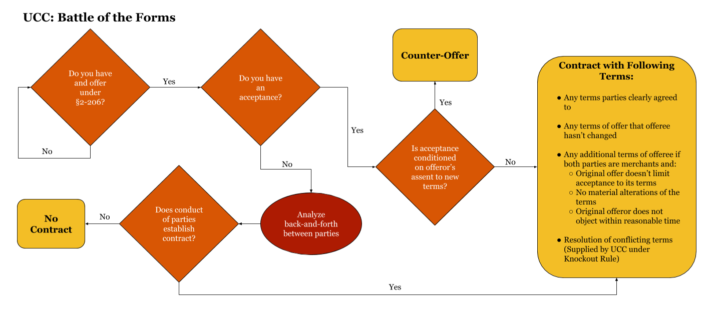

# Contract Formation Under UCC Article 2

## UCC and Mutual Assent

* **UCC**: Uniform law proposal, seeking to govern the sale of goods, that must be enacted by a state legislature to take effect. Preexisting principles of common law supplement the UCC unless they conflict.
  * Has been adopted either partially or in whole by every state
  * Applies to both consumer and commercial goods
  * Goods generally defined as moveable property. IP, real estate, leases, and services are not goods
* Predominant Purpose Test:
  * Used to determine if transaction falls under scope of UCC Article to if it is for a mix of goods and other forms of property/services
  * It does this by attempting to ascertain the primary purpose of the transaction
* Formation under the UCC
  * More liberal approach to indefiniteness of terms than the common law, emphasizing the parties intent to be bound even if some terms are left open.
  * § 2-204. Formation in General
    > 1. A contract for sale of goods may be made in any manner sufficient to show agreement, including conduct by both parties which recognizes the existence of such a contract
    > 2. An agreement sufficient to constitute a contract for sale may be found even though the moment of its making is undetermined
    > 3. Even though one or more terms are left open a contract for sale does not fail for indefiniteness if the parties have intended to make a contract and there is a reasonably certain basis for giving an appropriate remedy
  * § 2-305:  Allows contract even if open price term and supplements reasonable price at time of delivery, unless parties only intend to be bound insofar as a fixed price can be agreed upon.

### *Jannusch v. Naffziger*

Defendant purchases food truck business, including the truck itself, from plaintiffs. While having paid $10,000 for the right to purchase the business but not signing a formal contract, defendant takes ownership and begins operating the business. After the income was lower than expected, defendant tries to return food truck. Court rules that **UCC should govern this transaction after applying the predominant purpose test, as it was predominantly for the food truck and not the intangible components of the business**. While defendants contend no contract existed due to incompleteness of terms, court found that the essential terms of the contract had been defined as required for enforcement under UCC. Additionally, **parties expressing intent to be bound while some terms are still indefinite is sufficient to establish a contract.** The parties' conduct, by transferring the goods, clearly show the sale has taken place. That the signing of a formal written contract was still outstanding does not make the agreement unenforceable under certain conditions. Hence, returning the truck was breach of contract.

### *E.C. Styberg Engineering Co. v. Eaton Corp.*

Engineering company (P) sues auto-part manufacturer (D) for breach of contract. Parties began negotiated agreement for P to custom manufacture part for D's transmissions. Since additional machinery needed to make custom part, P needed to secure minimum-purchase contract to cover the capital investment. D responded with letter indicating willingness to commit to minimum quantity. While negotiations still ongoing, production of initial units begin and D cancels order. Court cites Ohio's adoption of UCC stating a contract may be made in any manner sufficient to show agreement, including conduct by both parties which recognizes the existence of such a contract (i.e. intent to be bound). However, **there is still the requirement for essential terms of the contract to be defined**, including the quantity. The communication between parties clearly showed that negotiations over these terms were still ongoing. Additionally, the purchase order for 250 units at quoted price does not show intent to be bound to minimum quantity of 13,000 units. Hence, court found that there was no contract.

---

## Qualified Acceptance: Battle of the Forms

* Common Law Approach
  * Mirror Image Rule - Varying acceptance has the effect of only a counter offer. Offeror is master of the offer and any attempt to accept according to different terms is a rejection and a new offer in which the original offeree assumes role as master.
    * Restatement (Second) §59 appears to support this rule, though *comment a.* indicates Restatement is trying to steer courts closer to the UCC.
  * Last Shot Rule
    * A party impliedly assented to and thereby accepted a counter-offer by conduct indicating lack of objection to it.
    * Both parties submitted their own terms, but terms last submitted prior to performance control the contract
    * Tends to favor sellers over buyers since sellers typically "fire the last shot" (i.e. send the last form). Buyers then accept by performing (receiving goods)
* Improvements over common law approach
  * UCC treatment of varying acceptance is viewed as an amelioration of strict mirror image rule, as it permits non-matching communications to form a contract if the parties apparently intended that they should. In many contexts, terms of offer an acceptance are rarely identical
  * CL Last shot rule can drag out negotiations since last form is what controls. It also enables unsophisticated persons from being exploited by last offeror

### Rules - Qualified Acceptance

* **UCC § 2-206 - Offer and Acceptance in Formation of Contract**
  * Unless otherwise unambiguously indicated by the language or circumstances
    1. An offer to make a contract shall be construed as inviting acceptance in any manner and by any medium reasonable in the circumstances
    1. An order or other offer to buy goods for prompt or current shipment shall be construed as inviting acceptance either by a prompt promise to ship or by the prompt or current shipment of conforming or non-conforming goods, but such a shipment of non-conforming goods does not constitute an acceptance if the seller seasonably (within a reasonable time) notifies the buyer that the shipment is offered only as an accommodation to the buyer
       * “But” clause - Acknowledges the sending of non-conforming goods, but doing this to accommodate buyer. Permits buyer to retain and pay for them or reject the (hence defeating the contract). This is not seen as an acceptance but as a counteroffer by the seller (no risk of breaching buyers original offer)
  * Where the beginning of a requested performance is a reasonable mode of acceptance an offeror who is not notified of acceptance within a reasonable time may treat the offer as having lapsed before acceptance.
* **UCC § 2-207 - Additional Terms in Acceptance or Confirmation**
  * Offeror's definite and seasonable expression response to offer is valid, even with additional or different terms, unless acceptance is expressly made conditional on offeror's assent to new terms, in which case it constitutes a counter offer.
  * The conditional nature of the acceptance, to the extent necessary to constitute a counter-offer, must be clearly expressed in a manner sufficient to notify the offeror that the offeree is unwilling to proceed with the transaction unless additional/different terms are included in the contract.
  * The changed/additional terms become part of the contract between merchants unless:
    1. the original offer limits acceptance to its terms
    1. they materially alter terms of the original offer
    1. offeror objects to new terms within a reasonable time from notification
  * Where acceptance is "expressly conditional", conduct by parties recognizing existence of a K is sufficient to establish K even where the writings of the parties do not otherwise establish a contract. In these cases, terms are writings on which parties agree along with supplementary terms
  * Comments
    * Where parties are not both merchants, there is still a K, but additional terms are only proposals to modify and must be assented to as a modification
    * Knockout Approach - Where there are conflicting terms in different forms, both terms dropout and term is supplied by UCC default
* **CISG (Art. 16)**
  * Appears to follow common law approach similar to mirror image rule
  * Material changes are counter-offer, but different terms that are not material nor objected to become part of K. 
  * Material terms include: price, payment, quantity, place/time, etc. Thus most changes are considered material

### Battle of the Forms: Visualized

### *Princess Cruises, Inc. v. General Elec. Co.*

P brought suit against D for breach (contract & express warranty) seeking to recover revenue lost while a ship was out of service for repair in excess of the period agreed to in the contract. Lower court entered judgment shipowner on breach of contract claim. D appealed, contending UCC was improperly applied. Applying the primary purpose test, court determines the contract was for services (ship repair) instead of sale of goods. Thus, contract guided by common law and not the UCC. **Under the common law, an acceptance that varies the terms of the offer is a counteroffer which rejects the terms of the original offer. Additionally, an offeror who proceeds under a contract after receiving the counter offer can accept the terms by performance**. P's performance and silence about the modified terms gave D every reason to believe P assented to new terms and contracts. Since modified terms of contract limited liability of D, court reverses and remands lower court's original judgement for P.

### *Brown Machine, Inc. v. Hercules, Inc.*

Seller of manufacturing equipment (P) sued buyer (D) for breach of indemnity clause. D submitted purchase order which contained language that expressly limited acceptance to the terms stated and any additional/modified ones are rejected unless agreed to in writing. P responds with order acknowledgement, which contained all purchase order terms plus indemnity clause. Trial court entered judgement for P and D appealed. Applying UCC, CoA determined D's purchase order constituted an offer, not an acceptance, because the initial price quotation was only an invitation to make an offer (i.e. D would not have reasonably believed price quotation to be an offer). UCC holds that an offeree's response to an offer operates as a valid acceptance, despite new/modified terms, unless offeree's acceptance is made expressly conditional on offeror's assent in which case the acceptance operates as a counter-offer. Court rules that P's acceptance of purchase order was not made "expressly conditional", meaning it did not clearly manifest its unwillingness to proceed with the sale unless D agreed to additional terms, therefore it was not a counteroffer but an acceptance with additional terms. Under UCC, **such terms of a qualified acceptance become part of the contract unless (1) the offer expressly limits acceptance to its terms; (2) they materially alter terms; or (3) original offeror provides notice objecting to these terms within a reasonable time**. Since the purchase order limited acceptance to its terms, the additional indemnification provision did not become part of the contract. Thus, court rules there was no breach.

### *Paul Gottlieb & Co., Inc. v. Alps South Corp*

P brought action against D seeking damages due to D's nonpayment of bill in a contract to purchase fabric. D had grew increasingly discontent with the quality of P's fabrics. D asserted counterclaim for breach of warranty. Both parties were awarded damages, but D was awarded significantly more in the counterclaim. TC asserted that limitation of P's liability in finished goods contract is considered, under UCC, **a material alteration and is thus not part of the contract**. P appealed. Court identified Florida code adopting UCC which provides standard recitation of the UCC qualified acceptance rule. Typically, terms that materially alter a contract would result in surprise if incorporated without express awareness by the other party. Thus, D **must show that it cannot be assumed a reasonable merchant would have consented to the additional term**. Court holds that limitation of damages is not the type of material term which would cause surprise or hardship, as explicitly identified in  UCC § 2-207 comment 5. Thus, court rules TC erred in awarding damages beyond the limitation

---
